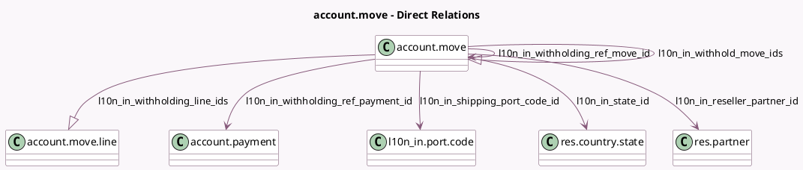

<!-- GENERATED:MODEL -->
---
tags: [odoo, community, generated, model]
---

# account.move

- Module: [[docs/Community Addons/l10n_in/l10n_in|l10n_in]]
- Scope: Community Addons
- Defined in module: extension only
- Source files: `models/account_invoice.py`
- Python classes: `AccountMove`

## Field footprint

- Detected fields: 23
- Field types: `Boolean` x 7, `Char` x 2, `Date` x 2, `Json` x 1, `Many2one` x 5, `Monetary` x 1, `One2many` x 2, `Selection` x 3
- Relation fields: 7

## Sample fields

- `l10n_in_display_higher_tcs_button`: `Boolean` (compute `_compute_l10n_in_display_higher_tcs_button`)
- `l10n_in_gst_treatment`: `Selection` (compute `_compute_l10n_in_gst_treatment`, store `True`)
- `l10n_in_gstin`: `Char`
- `l10n_in_gstin_verified_date`: `Date` (compute `_compute_l10n_in_partner_gstin_status_and_date`)
- `l10n_in_is_gst_registered_enabled`: `Boolean` (related `company_id.l10n_in_is_gst_registered`)
- `l10n_in_is_withholding`: `Boolean`
- `l10n_in_journal_type`: `Selection` (related `journal_id.type`)
- `l10n_in_partner_gstin_status`: `Boolean` (compute `_compute_l10n_in_partner_gstin_status_and_date`)
- `l10n_in_reseller_partner_id`: `Many2one` (comodel `res.partner`)
- `l10n_in_shipping_bill_date`: `Date` (comodel `Shipping bill date`)
- `l10n_in_shipping_bill_number`: `Char` (comodel `Shipping bill number`)
- `l10n_in_shipping_port_code_id`: `Many2one` (comodel `l10n_in.port.code`)
- `l10n_in_show_gstin_status`: `Boolean` (compute `_compute_l10n_in_show_gstin_status`)
- `l10n_in_state_id`: `Many2one` (comodel `res.country.state`, compute `_compute_l10n_in_state_id`, store `True`)
- `l10n_in_tcs_feature_enabled`: `Boolean` (related `company_id.l10n_in_tcs_feature`)
- `l10n_in_tds_deduction`: `Selection` (related `commercial_partner_id.l10n_in_pan_entity_id.tds_deduction`)
- `l10n_in_tds_feature_enabled`: `Boolean` (related `company_id.l10n_in_tds_feature`)
- `l10n_in_total_withholding_amount`: `Monetary` (compute `_compute_l10n_in_total_withholding_amount`)
- `l10n_in_warning`: `Json` (compute `_compute_l10n_in_warning`)
- `l10n_in_withhold_move_ids`: `One2many` (comodel `account.move`)

## Method hints

- Detected methods: 33
- Action methods: `action_l10n_in_apply_higher_tax`, `action_l10n_in_withholding_entries`
- Compute methods: `_compute_fiscal_position_id`, `_compute_l10n_in_display_higher_tcs_button`, `_compute_l10n_in_gst_treatment`, `_compute_l10n_in_partner_gstin_status_and_date`, `_compute_l10n_in_show_gstin_status`, `_compute_l10n_in_state_id`, `_compute_l10n_in_total_withholding_amount`, `_compute_l10n_in_warning`, and 1 more
- Onchange methods: `_onchange_name_warning`

## Direct relation diagram

## Navigation

- **Parent:** [[docs/Community Addons/l10n_in/Models]]

<!-- GENERATED:MODEL -->
