<!-- GENERATED:MODEL -->
---
tags: [odoo, community, generated, model]
---

# account.payment

- Module: [[docs/Community Addons/l10n_in/l10n_in|l10n_in]]
- Scope: Community Addons
- Defined in module: extension only
- Source files: `models/account_payment.py`
- Python classes: `AccountPayment`

## Field footprint

- Detected fields: 3
- Field types: `Boolean` x 1, `Monetary` x 1, `One2many` x 1
- Relation fields: 1

## Sample fields

- `l10n_in_tds_feature_enabled`: `Boolean` (related `company_id.l10n_in_tds_feature`)
- `l10n_in_total_withholding_amount`: `Monetary` (compute `_compute_l10n_in_total_withholding_amount`)
- `l10n_in_withhold_move_ids`: `One2many` (comodel `account.move`)

## Method hints

- Detected methods: 2
- Action methods: `action_l10n_in_withholding_entries`
- Compute methods: `_compute_l10n_in_total_withholding_amount`
- Onchange methods: none

## Direct relation diagram

```plantuml
@startuml
!define ODOO_COLOR_PRIMARY #714B67
!define ODOO_COLOR_ACCENT #875A7B
!define ODOO_COLOR_BG #FAF7FA

skinparam backgroundColor ODOO_COLOR_BG
skinparam defaultTextAlignment left
skinparam ArrowColor ODOO_COLOR_ACCENT
skinparam ClassBackgroundColor white
skinparam ClassBorderColor ODOO_COLOR_PRIMARY
skinparam ComponentBackgroundColor white
skinparam ComponentBorderColor ODOO_COLOR_PRIMARY
skinparam NoteBackgroundColor #FFF8FF
skinparam NoteBorderColor ODOO_COLOR_ACCENT
skinparam SequenceLifeLineBorderColor ODOO_COLOR_ACCENT
skinparam SequenceLifeLineBackgroundColor #FFFFFF
skinparam SequenceParticipantBorderColor ODOO_COLOR_PRIMARY
skinparam SequenceParticipantBackgroundColor #FFFFFF
skinparam sequence {
  ArrowColor ODOO_COLOR_ACCENT
  ActorBorderColor ODOO_COLOR_PRIMARY
}
title account.payment - Direct Relations
class "account.payment" as account_payment
class "account.move" as account_move
account_payment --|> account_move : l10n_in_withhold_move_ids
@enduml
```

## Navigation

- **Parent:** [[docs/Community Addons/l10n_in/Models]]

<!-- GENERATED:MODEL -->
