<!-- GENERATED:MODEL -->
---
tags: [odoo, community, generated, model]
---

# account.tax

- Module: [[docs/Community Addons/l10n_in/l10n_in|l10n_in]]
- Scope: Community Addons
- Defined in module: extension only
- Source files: `models/account_tax.py`
- Python classes: `AccountTax`

## Field footprint

- Detected fields: 7
- Field types: `Boolean` x 4, `Many2one` x 1, `Selection` x 2
- Relation fields: 1

## Sample fields

- `l10n_in_gst_tax_type`: `Selection` (compute `_compute_l10n_in_gst_tax_type`)
- `l10n_in_is_lut`: `Boolean`
- `l10n_in_reverse_charge`: `Boolean` (comodel `Reverse charge`)
- `l10n_in_section_id`: `Many2one` (comodel `l10n_in.section.alert`)
- `l10n_in_tax_type`: `Selection`
- `l10n_in_tcs_feature_enabled`: `Boolean` (related `company_id.l10n_in_tcs_feature`)
- `l10n_in_tds_feature_enabled`: `Boolean` (related `company_id.l10n_in_tds_feature`)

## Method hints

- Detected methods: 3
- Action methods: none
- Compute methods: `_compute_l10n_in_gst_tax_type`
- Onchange methods: none

## Direct relation diagram

```plantuml
@startuml
!define ODOO_COLOR_PRIMARY #714B67
!define ODOO_COLOR_ACCENT #875A7B
!define ODOO_COLOR_BG #FAF7FA

skinparam backgroundColor ODOO_COLOR_BG
skinparam defaultTextAlignment left
skinparam ArrowColor ODOO_COLOR_ACCENT
skinparam ClassBackgroundColor white
skinparam ClassBorderColor ODOO_COLOR_PRIMARY
skinparam ComponentBackgroundColor white
skinparam ComponentBorderColor ODOO_COLOR_PRIMARY
skinparam NoteBackgroundColor #FFF8FF
skinparam NoteBorderColor ODOO_COLOR_ACCENT
skinparam SequenceLifeLineBorderColor ODOO_COLOR_ACCENT
skinparam SequenceLifeLineBackgroundColor #FFFFFF
skinparam SequenceParticipantBorderColor ODOO_COLOR_PRIMARY
skinparam SequenceParticipantBackgroundColor #FFFFFF
skinparam sequence {
  ArrowColor ODOO_COLOR_ACCENT
  ActorBorderColor ODOO_COLOR_PRIMARY
}
title account.tax - Direct Relations
class "account.tax" as account_tax
class "l10n_in.section.alert" as l10n_in_section_alert
account_tax --> l10n_in_section_alert : l10n_in_section_id
@enduml
```

## Navigation

- **Parent:** [[docs/Community Addons/l10n_in/Models]]

<!-- GENERATED:MODEL -->
