<!-- GENERATED:MODEL -->
---
tags: [odoo, community, generated, model]
---

# l10n_in.pan.entity

- Module: [[docs/Community Addons/l10n_in/l10n_in|l10n_in]]
- Scope: Community Addons
- Defined in module: yes
- Source files: `models/l10n_in_pan_entity.py`
- Python classes: `L10nInPanEntity`
- Description: Indian PAN Entity
- Inherits: `mail.activity.mixin`, `mail.thread`

## Field footprint

- Detected fields: 8
- Field types: `Binary` x 1, `Char` x 3, `One2many` x 1, `Selection` x 3
- Relation fields: 1

## Sample fields

- `msme_number`: `Char`
- `msme_type`: `Selection`
- `name`: `Char`
- `partner_ids`: `One2many` (comodel `res.partner`)
- `tds_certificate`: `Binary`
- `tds_certificate_filename`: `Char`
- `tds_deduction`: `Selection`
- `type`: `Selection` (compute `_compute_type`, store `True`)

## Method hints

- Detected methods: 4
- Action methods: none
- Compute methods: `_compute_type`
- Onchange methods: none

## Direct relation diagram

```plantuml
@startuml
!define ODOO_COLOR_PRIMARY #714B67
!define ODOO_COLOR_ACCENT #875A7B
!define ODOO_COLOR_BG #FAF7FA

skinparam backgroundColor ODOO_COLOR_BG
skinparam defaultTextAlignment left
skinparam ArrowColor ODOO_COLOR_ACCENT
skinparam ClassBackgroundColor white
skinparam ClassBorderColor ODOO_COLOR_PRIMARY
skinparam ComponentBackgroundColor white
skinparam ComponentBorderColor ODOO_COLOR_PRIMARY
skinparam NoteBackgroundColor #FFF8FF
skinparam NoteBorderColor ODOO_COLOR_ACCENT
skinparam SequenceLifeLineBorderColor ODOO_COLOR_ACCENT
skinparam SequenceLifeLineBackgroundColor #FFFFFF
skinparam SequenceParticipantBorderColor ODOO_COLOR_PRIMARY
skinparam SequenceParticipantBackgroundColor #FFFFFF
skinparam sequence {
  ArrowColor ODOO_COLOR_ACCENT
  ActorBorderColor ODOO_COLOR_PRIMARY
}
title l10n_in.pan.entity - Direct Relations
class "l10n_in.pan.entity" as l10n_in_pan_entity
class "res.partner" as res_partner
l10n_in_pan_entity --|> res_partner : partner_ids
@enduml
```

## Navigation

- **Parent:** [[docs/Community Addons/l10n_in/Models]]

<!-- GENERATED:MODEL -->
