<!-- GENERATED:MODEL -->
---
tags: [odoo, community, generated, model]
---

# l10n_in.section.alert

- Module: [[docs/Community Addons/l10n_in/l10n_in|l10n_in]]
- Scope: Community Addons
- Defined in module: yes
- Source files: `models/l10n_in_section_alert.py`
- Python classes: `L10n_InSectionAlert`
- Description: indian section alert

## Field footprint

- Detected fields: 10
- Field types: `Boolean` x 2, `Char` x 1, `Float` x 2, `Many2one` x 1, `One2many` x 1, `Selection` x 3
- Relation fields: 2

## Sample fields

- `aggregate_limit`: `Float` (comodel `Aggregate limit`)
- `aggregate_period`: `Selection`
- `consider_amount`: `Selection`
- `is_aggregate_limit`: `Boolean` (comodel `Aggregate`)
- `is_per_transaction_limit`: `Boolean` (comodel `Per Transaction`)
- `l10n_in_section_tax_ids`: `One2many` (comodel `account.tax`)
- `name`: `Char` (comodel `Section Name`)
- `per_transaction_limit`: `Float` (comodel `Per Transaction limit`)
- `tax_report_line_id`: `Many2one` (comodel `account.report.line`)
- `tax_source_type`: `Selection`

## Method hints

- Detected methods: 2
- Action methods: none
- Compute methods: `_compute_display_name`
- Onchange methods: none

## Direct relation diagram

```plantuml
@startuml
!define ODOO_COLOR_PRIMARY #714B67
!define ODOO_COLOR_ACCENT #875A7B
!define ODOO_COLOR_BG #FAF7FA

skinparam backgroundColor ODOO_COLOR_BG
skinparam defaultTextAlignment left
skinparam ArrowColor ODOO_COLOR_ACCENT
skinparam ClassBackgroundColor white
skinparam ClassBorderColor ODOO_COLOR_PRIMARY
skinparam ComponentBackgroundColor white
skinparam ComponentBorderColor ODOO_COLOR_PRIMARY
skinparam NoteBackgroundColor #FFF8FF
skinparam NoteBorderColor ODOO_COLOR_ACCENT
skinparam SequenceLifeLineBorderColor ODOO_COLOR_ACCENT
skinparam SequenceLifeLineBackgroundColor #FFFFFF
skinparam SequenceParticipantBorderColor ODOO_COLOR_PRIMARY
skinparam SequenceParticipantBackgroundColor #FFFFFF
skinparam sequence {
  ArrowColor ODOO_COLOR_ACCENT
  ActorBorderColor ODOO_COLOR_PRIMARY
}
title l10n_in.section.alert - Direct Relations
class "l10n_in.section.alert" as l10n_in_section_alert
class "account.report.line" as account_report_line
class "account.tax" as account_tax
l10n_in_section_alert --|> account_tax : l10n_in_section_tax_ids
l10n_in_section_alert --> account_report_line : tax_report_line_id
@enduml
```

## Navigation

- **Parent:** [[docs/Community Addons/l10n_in/Models]]

<!-- GENERATED:MODEL -->
