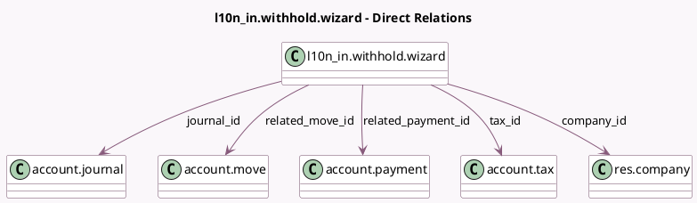

<!-- GENERATED:MODEL -->
---
tags: [odoo, community, generated, model]
---

# l10n_in.withhold.wizard

- Module: [[docs/Community Addons/l10n_in/l10n_in|l10n_in]]
- Scope: Community Addons
- Defined in module: yes
- Source files: `wizard/l10n_in_withhold_wizard.py`
- Python classes: `L10n_InWithholdWizard`
- Description: Withhold Wizard

## Field footprint

- Detected fields: 14
- Field types: `Char` x 3, `Date` x 1, `Json` x 1, `Many2one` x 6, `Monetary` x 2, `Selection` x 1
- Relation fields: 6

## Sample fields

- `amount`: `Monetary` (compute `_compute_amount`)
- `base`: `Monetary` (compute `_compute_base`, store `True`)
- `company_id`: `Many2one` (comodel `res.company`, compute `_compute_company_id`)
- `currency_id`: `Many2one` (related `company_id.currency_id`)
- `date`: `Date`
- `journal_id`: `Many2one` (comodel `account.journal`, compute `_compute_journal`, store `True`)
- `l10n_in_tds_tax_type`: `Char` (compute `_compute_l10n_in_tds_tax_type`)
- `l10n_in_withholding_warning`: `Json` (compute `_compute_l10n_in_withholding_warning`)
- `reference`: `Char`
- `related_move_id`: `Many2one` (comodel `account.move`)
- `related_payment_id`: `Many2one` (comodel `account.payment`)
- `tax_id`: `Many2one` (comodel `account.tax`, compute `_compute_tax_id`, store `True`)
- `tds_deduction`: `Selection` (compute `_compute_tds_deduction`)
- `type_name`: `Char` (compute `_compute_type_name`)

## Method hints

- Detected methods: 16
- Action methods: `action_create_and_post_withhold`
- Compute methods: `_compute_amount`, `_compute_base`, `_compute_company_id`, `_compute_journal`, `_compute_l10n_in_tds_tax_type`, `_compute_l10n_in_withholding_warning`, `_compute_tax_id`, `_compute_tds_deduction`, and 1 more
- Onchange methods: none

## Direct relation diagram

## Navigation

- **Parent:** [[docs/Community Addons/l10n_in/Models]]

<!-- GENERATED:MODEL -->
