<!-- GENERATED:MODEL -->
---
tags: [odoo, community, generated, model]
---

# res.company

- Module: [[docs/Community Addons/l10n_in/l10n_in|l10n_in]]
- Scope: Community Addons
- Defined in module: extension only
- Source files: `models/company.py`
- Python classes: `ResCompany`

## Field footprint

- Detected fields: 13
- Field types: `Boolean` x 5, `Char` x 3, `Many2one` x 3, `Selection` x 2
- Relation fields: 3

## Sample fields

- `l10n_in_edi_production_env`: `Boolean`
- `l10n_in_gst_state_warning`: `Char` (related `partner_id.l10n_in_gst_state_warning`)
- `l10n_in_gstin_status_feature`: `Boolean`
- `l10n_in_hsn_code_digit`: `Selection` (compute `_compute_l10n_in_hsn_code_digit`, store `True`)
- `l10n_in_is_gst_registered`: `Boolean` (compute `_compute_l10n_in_parent_based_features`, store `True`)
- `l10n_in_pan_entity_id`: `Many2one` (related `partner_id.l10n_in_pan_entity_id`, store `True`)
- `l10n_in_pan_type`: `Selection` (related `l10n_in_pan_entity_id.type`)
- `l10n_in_tan`: `Char` (related `partner_id.l10n_in_tan`)
- `l10n_in_tcs_feature`: `Boolean` (compute `_compute_l10n_in_parent_based_features`, store `True`)
- `l10n_in_tds_feature`: `Boolean` (compute `_compute_l10n_in_parent_based_features`, store `True`)
- `l10n_in_upi_id`: `Char`
- `l10n_in_withholding_account_id`: `Many2one` (comodel `account.account`)
- `l10n_in_withholding_journal_id`: `Many2one` (comodel `account.journal`)

## Method hints

- Detected methods: 13
- Action methods: `action_update_state_as_per_gstin`
- Compute methods: `_compute_l10n_in_hsn_code_digit`, `_compute_l10n_in_parent_based_features`
- Onchange methods: `onchange_vat`

## Direct relation diagram

```plantuml
@startuml
!define ODOO_COLOR_PRIMARY #714B67
!define ODOO_COLOR_ACCENT #875A7B
!define ODOO_COLOR_BG #FAF7FA

skinparam backgroundColor ODOO_COLOR_BG
skinparam defaultTextAlignment left
skinparam ArrowColor ODOO_COLOR_ACCENT
skinparam ClassBackgroundColor white
skinparam ClassBorderColor ODOO_COLOR_PRIMARY
skinparam ComponentBackgroundColor white
skinparam ComponentBorderColor ODOO_COLOR_PRIMARY
skinparam NoteBackgroundColor #FFF8FF
skinparam NoteBorderColor ODOO_COLOR_ACCENT
skinparam SequenceLifeLineBorderColor ODOO_COLOR_ACCENT
skinparam SequenceLifeLineBackgroundColor #FFFFFF
skinparam SequenceParticipantBorderColor ODOO_COLOR_PRIMARY
skinparam SequenceParticipantBackgroundColor #FFFFFF
skinparam sequence {
  ArrowColor ODOO_COLOR_ACCENT
  ActorBorderColor ODOO_COLOR_PRIMARY
}
title res.company - Direct Relations
class "res.company" as res_company
class "account.account" as account_account
class "account.journal" as account_journal
res_company --> account_account : l10n_in_withholding_account_id
res_company --> account_journal : l10n_in_withholding_journal_id
@enduml
```

## Navigation

- **Parent:** [[docs/Community Addons/l10n_in/Models]]

<!-- GENERATED:MODEL -->
