<!-- GENERATED:MODEL -->
---
tags: [odoo, community, generated, model]
---

# res.config.settings

- Module: [[docs/Community Addons/l10n_in/l10n_in|l10n_in]]
- Scope: Community Addons
- Defined in module: extension only
- Source files: `models/res_config_settings.py`
- Python classes: `ResConfigSettings`

## Field footprint

- Detected fields: 17
- Field types: `Boolean` x 12, `Char` x 2, `Many2one` x 2, `Selection` x 1
- Relation fields: 2

## Sample fields

- `group_l10n_in_reseller`: `Boolean`
- `l10n_in_edi_production_env`: `Boolean` (related `company_id.l10n_in_edi_production_env`)
- `l10n_in_enet_vendor_batch_payment_feature`: `Boolean`
- `l10n_in_fetch_vendor_edi_feature`: `Boolean`
- `l10n_in_gst_efiling_feature`: `Boolean`
- `l10n_in_gstin`: `Char` (related `company_id.vat`)
- `l10n_in_gstin_status_feature`: `Boolean` (related `company_id.l10n_in_gstin_status_feature`)
- `l10n_in_hsn_code_digit`: `Selection` (related `company_id.l10n_in_hsn_code_digit`)
- `l10n_in_is_gst_registered`: `Boolean` (related `company_id.l10n_in_is_gst_registered`)
- `l10n_in_tan`: `Char` (related `company_id.l10n_in_tan`)
- `l10n_in_tcs_feature`: `Boolean` (related `company_id.l10n_in_tcs_feature`)
- `l10n_in_tds_feature`: `Boolean` (related `company_id.l10n_in_tds_feature`)
- `l10n_in_withholding_account_id`: `Many2one` (related `company_id.l10n_in_withholding_account_id`)
- `l10n_in_withholding_journal_id`: `Many2one` (related `company_id.l10n_in_withholding_journal_id`)
- `module_l10n_in_edi`: `Boolean` (comodel `Indian Electronic Invoicing`)
- `module_l10n_in_ewaybill`: `Boolean` (comodel `Indian Electronic Waybill`)
- `module_l10n_in_reports`: `Boolean` (comodel `GST E-Filing & Matching`)

## Method hints

- Detected methods: 5
- Action methods: none
- Compute methods: none
- Onchange methods: none

## Direct relation diagram

```plantuml
@startuml
!define ODOO_COLOR_PRIMARY #714B67
!define ODOO_COLOR_ACCENT #875A7B
!define ODOO_COLOR_BG #FAF7FA

skinparam backgroundColor ODOO_COLOR_BG
skinparam defaultTextAlignment left
skinparam ArrowColor ODOO_COLOR_ACCENT
skinparam ClassBackgroundColor white
skinparam ClassBorderColor ODOO_COLOR_PRIMARY
skinparam ComponentBackgroundColor white
skinparam ComponentBorderColor ODOO_COLOR_PRIMARY
skinparam NoteBackgroundColor #FFF8FF
skinparam NoteBorderColor ODOO_COLOR_ACCENT
skinparam SequenceLifeLineBorderColor ODOO_COLOR_ACCENT
skinparam SequenceLifeLineBackgroundColor #FFFFFF
skinparam SequenceParticipantBorderColor ODOO_COLOR_PRIMARY
skinparam SequenceParticipantBackgroundColor #FFFFFF
skinparam sequence {
  ArrowColor ODOO_COLOR_ACCENT
  ActorBorderColor ODOO_COLOR_PRIMARY
}
title res.config.settings - Direct Relations
class "res.config.settings" as res_config_settings
@enduml
```

## Navigation

- **Parent:** [[docs/Community Addons/l10n_in/Models]]

<!-- GENERATED:MODEL -->
