<!-- GENERATED:MODEL -->
---
tags: [odoo, community, generated, model]
---

# res.partner

- Module: [[docs/Community Addons/l10n_in/l10n_in|l10n_in]]
- Scope: Community Addons
- Defined in module: extension only
- Source files: `models/res_partner.py`
- Python classes: `ResPartner`

## Field footprint

- Detected fields: 9
- Field types: `Boolean` x 4, `Char` x 2, `Date` x 1, `Many2one` x 1, `Selection` x 1
- Relation fields: 1

## Sample fields

- `display_pan_warning`: `Boolean` (compute `_compute_display_pan_warning`)
- `l10n_in_gst_state_warning`: `Char` (compute `_compute_l10n_in_gst_state_warning`)
- `l10n_in_gst_treatment`: `Selection`
- `l10n_in_gstin_status_feature_enabled`: `Boolean` (compute `_compute_l10n_in_gst_registered_and_status`)
- `l10n_in_gstin_verified_date`: `Date`
- `l10n_in_gstin_verified_status`: `Boolean`
- `l10n_in_is_gst_registered_enabled`: `Boolean` (compute `_compute_l10n_in_gst_registered_and_status`)
- `l10n_in_pan_entity_id`: `Many2one` (comodel `l10n_in.pan.entity`)
- `l10n_in_tan`: `Char` (comodel `TAN`)

## Method hints

- Detected methods: 13
- Action methods: `action_l10n_in_verify_gstin_status`, `action_update_state_as_per_gstin`
- Compute methods: `_compute_display_pan_warning`, `_compute_l10n_in_gst_registered_and_status`, `_compute_l10n_in_gst_state_warning`
- Onchange methods: `_onchange_l10n_in_gst_status`, `onchange_vat`

## Direct relation diagram

```plantuml
@startuml
!define ODOO_COLOR_PRIMARY #714B67
!define ODOO_COLOR_ACCENT #875A7B
!define ODOO_COLOR_BG #FAF7FA

skinparam backgroundColor ODOO_COLOR_BG
skinparam defaultTextAlignment left
skinparam ArrowColor ODOO_COLOR_ACCENT
skinparam ClassBackgroundColor white
skinparam ClassBorderColor ODOO_COLOR_PRIMARY
skinparam ComponentBackgroundColor white
skinparam ComponentBorderColor ODOO_COLOR_PRIMARY
skinparam NoteBackgroundColor #FFF8FF
skinparam NoteBorderColor ODOO_COLOR_ACCENT
skinparam SequenceLifeLineBorderColor ODOO_COLOR_ACCENT
skinparam SequenceLifeLineBackgroundColor #FFFFFF
skinparam SequenceParticipantBorderColor ODOO_COLOR_PRIMARY
skinparam SequenceParticipantBackgroundColor #FFFFFF
skinparam sequence {
  ArrowColor ODOO_COLOR_ACCENT
  ActorBorderColor ODOO_COLOR_PRIMARY
}
title res.partner - Direct Relations
class "res.partner" as res_partner
class "l10n_in.pan.entity" as l10n_in_pan_entity
res_partner --> l10n_in_pan_entity : l10n_in_pan_entity_id
@enduml
```

## Navigation

- **Parent:** [[docs/Community Addons/l10n_in/Models]]

<!-- GENERATED:MODEL -->
