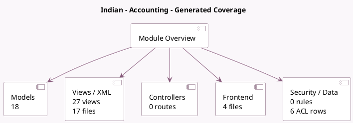

<!-- GENERATED:MODULE -->
---
tags: [odoo, community, module]
---

# Indian - Accounting

- Scope: Community Addons
- Source: odoo/addons/l10n_in
- Dependencies: [[docs/Community Addons/account_tax_python/account_tax_python|account_tax_python]], [[docs/Community Addons/base_vat/base_vat|base_vat]], [[docs/Community Addons/account_debit_note/account_debit_note|account_debit_note]], [[docs/Community Addons/account/account|account]], [[docs/Community Addons/iap/iap|iap]]

## Generated coverage

- Models: 18
- XML files with UI/data artifacts: 17
- Views: 27
- Actions: 3
- Menus: 2
- Rules (ir.rule): 0
- Access CSV entries: 6
- Controller units: 0
- Frontend asset files: 4

## Module map

## Detail notes

- Models: [[docs/Community Addons/l10n_in/Models|Models]] (18)
- Views and XML: [[docs/Community Addons/l10n_in/Views|Views]] (17 files)
- Frontend: [[docs/Community Addons/l10n_in/Frontend|Frontend]] (4 files)

## Key models

- `account.account`
- `account.chart.template`
- `account.move`
- `account.move.line`
- `account.payment`
- `account.report`
- `account.tax`
- `iap.account`
- `l10n_in.pan.entity`
- `l10n_in.port.code`
- `l10n_in.section.alert`
- `l10n_in.withhold.wizard`

## Navigation

- [[../Community Addons/Community Addons|Back to scope]]
- [[../../docs/docs|Back to docs]]

<!-- GENERATED:MODULE -->

