<!-- GENERATED:MODEL -->
---
tags: [odoo, community, generated, model]
---

# account.move

- Module: [[docs/Community Addons/l10n_in_ewaybill/l10n_in_ewaybill|l10n_in_ewaybill]]
- Scope: Community Addons
- Defined in module: extension only
- Source files: `models/account_move.py`
- Python classes: `AccountMove`

## Field footprint

- Detected fields: 4
- Field types: `Boolean` x 1, `Char` x 1, `Datetime` x 1, `One2many` x 1
- Relation fields: 1

## Sample fields

- `l10n_in_ewaybill_expiry_date`: `Datetime` (compute `_compute_l10n_in_ewaybill_details`)
- `l10n_in_ewaybill_feature_enabled`: `Boolean` (related `company_id.l10n_in_ewaybill_feature`)
- `l10n_in_ewaybill_ids`: `One2many` (comodel `l10n.in.ewaybill`)
- `l10n_in_ewaybill_name`: `Char` (comodel `Indian Ewaybill Number`, compute `_compute_l10n_in_ewaybill_details`)

## Method hints

- Detected methods: 4
- Action methods: `action_l10n_in_ewaybill_create`, `action_open_l10n_in_ewaybill`
- Compute methods: `_compute_l10n_in_ewaybill_details`
- Onchange methods: none

## Direct relation diagram

```plantuml
@startuml
!define ODOO_COLOR_PRIMARY #714B67
!define ODOO_COLOR_ACCENT #875A7B
!define ODOO_COLOR_BG #FAF7FA

skinparam backgroundColor ODOO_COLOR_BG
skinparam defaultTextAlignment left
skinparam ArrowColor ODOO_COLOR_ACCENT
skinparam ClassBackgroundColor white
skinparam ClassBorderColor ODOO_COLOR_PRIMARY
skinparam ComponentBackgroundColor white
skinparam ComponentBorderColor ODOO_COLOR_PRIMARY
skinparam NoteBackgroundColor #FFF8FF
skinparam NoteBorderColor ODOO_COLOR_ACCENT
skinparam SequenceLifeLineBorderColor ODOO_COLOR_ACCENT
skinparam SequenceLifeLineBackgroundColor #FFFFFF
skinparam SequenceParticipantBorderColor ODOO_COLOR_PRIMARY
skinparam SequenceParticipantBackgroundColor #FFFFFF
skinparam sequence {
  ArrowColor ODOO_COLOR_ACCENT
  ActorBorderColor ODOO_COLOR_PRIMARY
}
title account.move - Direct Relations
class "account.move" as account_move
class "l10n.in.ewaybill" as l10n_in_ewaybill
account_move --|> l10n_in_ewaybill : l10n_in_ewaybill_ids
@enduml
```

## Navigation

- **Parent:** [[docs/Community Addons/l10n_in_ewaybill/Models]]

<!-- GENERATED:MODEL -->
