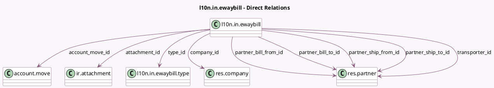

<!-- GENERATED:MODEL -->
---
tags: [odoo, community, generated, model]
---

# l10n.in.ewaybill

- Module: [[docs/Community Addons/l10n_in_ewaybill/l10n_in_ewaybill|l10n_in_ewaybill]]
- Scope: Community Addons
- Defined in module: yes
- Source files: `models/l10n_in_ewaybill.py`
- Python classes: `L10nInEwaybill`
- Description: e-Waybill
- Inherits: `mail.activity.mixin`, `mail.thread`, `portal.mixin`

## Field footprint

- Detected fields: 34
- Field types: `Binary` x 2, `Boolean` x 4, `Char` x 6, `Date` x 3, `Datetime` x 1, `Html` x 1, `Integer` x 1, `Many2one` x 10, `Selection` x 6
- Relation fields: 10

## Sample fields

- `account_move_id`: `Many2one` (comodel `account.move`)
- `attachment_file`: `Binary`
- `attachment_id`: `Many2one` (comodel `ir.attachment`)
- `blocking_level`: `Selection`
- `cancel_reason`: `Selection`
- `cancel_remarks`: `Char` (comodel `Cancel remarks`)
- `company_currency_id`: `Many2one` (related `company_id.currency_id`)
- `company_id`: `Many2one` (comodel `res.company`, compute `_compute_ewaybill_company`, store `True`)
- `content`: `Binary` (compute `_compute_content`)
- `distance`: `Integer` (comodel `Distance`)
- `document_date`: `Datetime` (comodel `Document Date`, compute `_compute_ewaybill_document_details`)
- `document_number`: `Char` (comodel `Document`, compute `_compute_ewaybill_document_details`)
- `error_message`: `Html`
- `ewaybill_date`: `Date` (comodel `e-Waybill Date`)
- `ewaybill_expiry_date`: `Date` (comodel `e-Waybill Valid Upto`)
- `is_bill_from_editable`: `Boolean` (compute `_compute_is_editable`)
- `is_bill_to_editable`: `Boolean` (compute `_compute_is_editable`)
- `is_ship_from_editable`: `Boolean` (compute `_compute_is_editable`)
- `is_ship_to_editable`: `Boolean` (compute `_compute_is_editable`)
- `mode`: `Selection`

## Method hints

- Detected methods: 49
- Action methods: `action_cancel_ewaybill`, `action_export_content_json`, `action_generate_ewaybill`, `action_print`, `action_reset_to_pending`
- Compute methods: `_compute_content`, `_compute_display_name`, `_compute_document_partners_details`, `_compute_ewaybill_company`, `_compute_ewaybill_document_details`, `_compute_is_editable`, `_compute_linked_attachment_id`, `_compute_supply_type`, and 1 more
- Onchange methods: none

## Direct relation diagram

## Navigation

- **Parent:** [[docs/Community Addons/l10n_in_ewaybill/Models]]

<!-- GENERATED:MODEL -->
