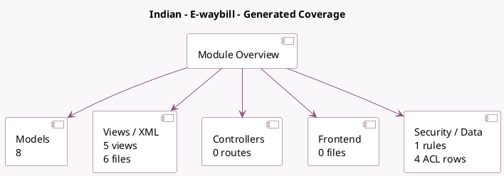

<!-- GENERATED:MODULE -->
---
tags: [odoo, community, module]
---

# Indian - E-waybill

- Scope: Community Addons
- Source: odoo/addons/l10n_in_ewaybill
- Dependencies: [[docs/Community Addons/l10n_in/l10n_in|l10n_in]]

## Generated coverage

- Models: 8
- XML files with UI/data artifacts: 6
- Views: 5
- Actions: 2
- Menus: 0
- Rules (ir.rule): 1
- Access CSV entries: 4
- Controller units: 0
- Frontend asset files: 0

## Module map

## Detail notes

- Models: [[docs/Community Addons/l10n_in_ewaybill/Models|Models]] (8)
- Views and XML: [[docs/Community Addons/l10n_in_ewaybill/Views|Views]] (6 files)

## Key models

- `account.chart.template`
- `account.move`
- `ir.attachment`
- `l10n.in.ewaybill`
- `l10n.in.ewaybill.cancel`
- `l10n.in.ewaybill.type`
- `res.company`
- `res.config.settings`

## Navigation

- [[../Community Addons/Community Addons|Back to scope]]
- [[../../docs/docs|Back to docs]]

<!-- GENERATED:MODULE -->

