<!-- GENERATED:MODEL -->
---
tags: [odoo, community, generated, model]
---

# l10n.in.ewaybill

- Module: [[docs/Community Addons/l10n_in_ewaybill_stock/l10n_in_ewaybill_stock|l10n_in_ewaybill_stock]]
- Scope: Community Addons
- Defined in module: extension only
- Source files: `models/l10n_in_ewaybill.py`
- Python classes: `L10nInEwaybill`

## Field footprint

- Detected fields: 5
- Field types: `Char` x 1, `Many2one` x 2, `One2many` x 1, `Selection` x 1
- Relation fields: 3

## Sample fields

- `fiscal_position_id`: `Many2one` (comodel `account.fiscal.position`, compute `_compute_fiscal_position`, store `True`)
- `move_ids`: `One2many` (related `picking_id.move_ids`)
- `picking_id`: `Many2one` (comodel `stock.picking`)
- `state`: `Selection`
- `type_description`: `Char`

## Method hints

- Detected methods: 17
- Action methods: `action_print`, `action_reset_to_pending`, `action_set_to_challan`
- Compute methods: `_compute_display_name`, `_compute_fiscal_position`
- Onchange methods: none

## Direct relation diagram

```plantuml
@startuml
!define ODOO_COLOR_PRIMARY #714B67
!define ODOO_COLOR_ACCENT #875A7B
!define ODOO_COLOR_BG #FAF7FA

skinparam backgroundColor ODOO_COLOR_BG
skinparam defaultTextAlignment left
skinparam ArrowColor ODOO_COLOR_ACCENT
skinparam ClassBackgroundColor white
skinparam ClassBorderColor ODOO_COLOR_PRIMARY
skinparam ComponentBackgroundColor white
skinparam ComponentBorderColor ODOO_COLOR_PRIMARY
skinparam NoteBackgroundColor #FFF8FF
skinparam NoteBorderColor ODOO_COLOR_ACCENT
skinparam SequenceLifeLineBorderColor ODOO_COLOR_ACCENT
skinparam SequenceLifeLineBackgroundColor #FFFFFF
skinparam SequenceParticipantBorderColor ODOO_COLOR_PRIMARY
skinparam SequenceParticipantBackgroundColor #FFFFFF
skinparam sequence {
  ArrowColor ODOO_COLOR_ACCENT
  ActorBorderColor ODOO_COLOR_PRIMARY
}
title l10n.in.ewaybill - Direct Relations
class "l10n.in.ewaybill" as l10n_in_ewaybill
class "account.fiscal.position" as account_fiscal_position
class "stock.picking" as stock_picking
l10n_in_ewaybill --> stock_picking : picking_id
l10n_in_ewaybill --> account_fiscal_position : fiscal_position_id
@enduml
```

## Navigation

- **Parent:** [[docs/Community Addons/l10n_in_ewaybill_stock/Models]]

<!-- GENERATED:MODEL -->
