<!-- GENERATED:MODEL -->
---
tags: [odoo, community, generated, model]
---

# stock.move

- Module: [[docs/Community Addons/l10n_in_ewaybill_stock/l10n_in_ewaybill_stock|l10n_in_ewaybill_stock]]
- Scope: Community Addons
- Defined in module: extension only
- Source files: `models/stock_move.py`
- Python classes: `StockMove`
- Description: Stock Move Ewaybill

## Field footprint

- Detected fields: 4
- Field types: `Many2many` x 1, `Many2one` x 1, `Monetary` x 1, `One2many` x 1
- Relation fields: 3

## Sample fields

- `company_currency_id`: `Many2one` (related `company_id.currency_id`)
- `ewaybill_price_unit`: `Monetary` (compute `_compute_l10n_in_ewaybill_price_unit`, store `True`)
- `ewaybill_tax_ids`: `Many2many` (comodel `account.tax`, compute `_compute_l10n_in_tax_ids`, store `True`)
- `l10n_in_ewaybill_ids`: `One2many` (related `picking_id.l10n_in_ewaybill_ids`)

## Method hints

- Detected methods: 2
- Action methods: none
- Compute methods: `_compute_l10n_in_ewaybill_price_unit`, `_compute_l10n_in_tax_ids`
- Onchange methods: none

## Direct relation diagram

```plantuml
@startuml
!define ODOO_COLOR_PRIMARY #714B67
!define ODOO_COLOR_ACCENT #875A7B
!define ODOO_COLOR_BG #FAF7FA

skinparam backgroundColor ODOO_COLOR_BG
skinparam defaultTextAlignment left
skinparam ArrowColor ODOO_COLOR_ACCENT
skinparam ClassBackgroundColor white
skinparam ClassBorderColor ODOO_COLOR_PRIMARY
skinparam ComponentBackgroundColor white
skinparam ComponentBorderColor ODOO_COLOR_PRIMARY
skinparam NoteBackgroundColor #FFF8FF
skinparam NoteBorderColor ODOO_COLOR_ACCENT
skinparam SequenceLifeLineBorderColor ODOO_COLOR_ACCENT
skinparam SequenceLifeLineBackgroundColor #FFFFFF
skinparam SequenceParticipantBorderColor ODOO_COLOR_PRIMARY
skinparam SequenceParticipantBackgroundColor #FFFFFF
skinparam sequence {
  ArrowColor ODOO_COLOR_ACCENT
  ActorBorderColor ODOO_COLOR_PRIMARY
}
title stock.move - Direct Relations
class "stock.move" as stock_move
class "account.tax" as account_tax
stock_move .. account_tax : ewaybill_tax_ids
@enduml
```

## Navigation

- **Parent:** [[docs/Community Addons/l10n_in_ewaybill_stock/Models]]

<!-- GENERATED:MODEL -->
