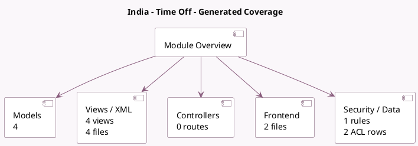

<!-- GENERATED:MODULE -->
---
tags: [odoo, community, module]
---

# India - Time Off

- Scope: Community Addons
- Source: odoo/addons/l10n_in_hr_holidays
- Dependencies: [[docs/Community Addons/hr_holidays/hr_holidays|hr_holidays]]

## Summary

Leave Management of Indian Localization

## Generated coverage

- Models: 4
- XML files with UI/data artifacts: 4
- Views: 4
- Actions: 1
- Menus: 1
- Rules (ir.rule): 1
- Access CSV entries: 2
- Controller units: 0
- Frontend asset files: 2

## Module map

## Detail notes

- Models: [[docs/Community Addons/l10n_in_hr_holidays/Models|Models]] (4)
- Views and XML: [[docs/Community Addons/l10n_in_hr_holidays/Views|Views]] (4 files)
- Frontend: [[docs/Community Addons/l10n_in_hr_holidays/Frontend|Frontend]] (2 files)

## Key models

- `hr.employee`
- `hr.leave`
- `hr.leave.type`
- `l10n.in.hr.leave.optional.holiday`

## Navigation

- [[../Community Addons/Community Addons|Back to scope]]
- [[../../docs/docs|Back to docs]]

<!-- GENERATED:MODULE -->

