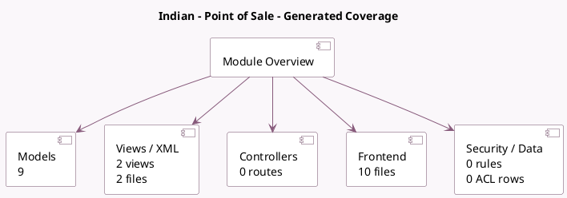

<!-- GENERATED:MODULE -->
---
tags: [odoo, community, module]
---

# Indian - Point of Sale

- Scope: Community Addons
- Source: odoo/addons/l10n_in_pos
- Dependencies: [[docs/Community Addons/l10n_in/l10n_in|l10n_in]], [[docs/Community Addons/point_of_sale/point_of_sale|point_of_sale]]

## Generated coverage

- Models: 9
- XML files with UI/data artifacts: 2
- Views: 2
- Actions: 0
- Menus: 0
- Rules (ir.rule): 0
- Access CSV entries: 0
- Controller units: 0
- Frontend asset files: 10

## Module map

## Detail notes

- Models: [[docs/Community Addons/l10n_in_pos/Models|Models]] (9)
- Views and XML: [[docs/Community Addons/l10n_in_pos/Views|Views]] (2 files)
- Frontend: [[docs/Community Addons/l10n_in_pos/Frontend|Frontend]] (10 files)

## Key models

- `account.move`
- `account.move.line`
- `account.tax`
- `pos.bill`
- `pos.config`
- `pos.order`
- `pos.order.line`
- `pos.session`
- `product.template`

## Navigation

- [[../Community Addons/Community Addons|Back to scope]]
- [[../../docs/docs|Back to docs]]

<!-- GENERATED:MODULE -->

