<!-- GENERATED:MODEL -->
---
tags: [odoo, community, generated, model]
---

# account.move

- Module: [[docs/Community Addons/l10n_it_edi/l10n_it_edi|l10n_it_edi]]
- Scope: Community Addons
- Defined in module: extension only
- Source files: `models/account_move.py`
- Python classes: `AccountMove`

## Field footprint

- Detected fields: 18
- Field types: `Binary` x 1, `Boolean` x 2, `Char` x 6, `Date` x 1, `Float` x 1, `Html` x 1, `Many2one` x 2, `Selection` x 4
- Relation fields: 2

## Sample fields

- `l10n_it_cig`: `Char`
- `l10n_it_cup`: `Char`
- `l10n_it_ddt_id`: `Many2one` (comodel `l10n_it.ddt`)
- `l10n_it_document_type`: `Many2one` (comodel `l10n_it.document.type`, compute `_compute_l10n_it_document_type`, store `True`)
- `l10n_it_edi_attachment_file`: `Binary`
- `l10n_it_edi_attachment_name`: `Char`
- `l10n_it_edi_button_label`: `Char` (compute `_compute_l10n_it_edi_button_label`)
- `l10n_it_edi_header`: `Html`
- `l10n_it_edi_is_self_invoice`: `Boolean` (compute `_compute_l10n_it_edi_is_self_invoice`)
- `l10n_it_edi_proxy_mode`: `Selection` (related `company_id.l10n_it_edi_proxy_user_id.edi_mode`)
- `l10n_it_edi_state`: `Selection`
- `l10n_it_edi_transaction`: `Char`
- `l10n_it_origin_document_date`: `Date`
- `l10n_it_origin_document_name`: `Char`
- `l10n_it_origin_document_type`: `Selection`
- `l10n_it_partner_pa`: `Boolean` (compute `_compute_l10n_it_partner_pa`)
- `l10n_it_payment_method`: `Selection` (compute `_compute_l10n_it_payment_method`, store `True`)
- `l10n_it_stamp_duty`: `Float`

## Method hints

- Detected methods: 69
- Action methods: `action_check_l10n_it_edi`, `action_invoice_download_fatturapa`, `action_l10n_it_edi_send`
- Compute methods: `_compute_l10n_it_document_type`, `_compute_l10n_it_edi_button_label`, `_compute_l10n_it_edi_is_self_invoice`, `_compute_l10n_it_partner_pa`, `_compute_l10n_it_payment_method`, `_compute_show_reset_to_draft_button`
- Onchange methods: none

## Direct relation diagram

```plantuml
@startuml
!define ODOO_COLOR_PRIMARY #714B67
!define ODOO_COLOR_ACCENT #875A7B
!define ODOO_COLOR_BG #FAF7FA

skinparam backgroundColor ODOO_COLOR_BG
skinparam defaultTextAlignment left
skinparam ArrowColor ODOO_COLOR_ACCENT
skinparam ClassBackgroundColor white
skinparam ClassBorderColor ODOO_COLOR_PRIMARY
skinparam ComponentBackgroundColor white
skinparam ComponentBorderColor ODOO_COLOR_PRIMARY
skinparam NoteBackgroundColor #FFF8FF
skinparam NoteBorderColor ODOO_COLOR_ACCENT
skinparam SequenceLifeLineBorderColor ODOO_COLOR_ACCENT
skinparam SequenceLifeLineBackgroundColor #FFFFFF
skinparam SequenceParticipantBorderColor ODOO_COLOR_PRIMARY
skinparam SequenceParticipantBackgroundColor #FFFFFF
skinparam sequence {
  ArrowColor ODOO_COLOR_ACCENT
  ActorBorderColor ODOO_COLOR_PRIMARY
}
title account.move - Direct Relations
class "account.move" as account_move
class "l10n_it.ddt" as l10n_it_ddt
class "l10n_it.document.type" as l10n_it_document_type
account_move --> l10n_it_ddt : l10n_it_ddt_id
account_move --> l10n_it_document_type : l10n_it_document_type
@enduml
```

## Navigation

- **Parent:** [[docs/Community Addons/l10n_it_edi/Models]]

<!-- GENERATED:MODEL -->
