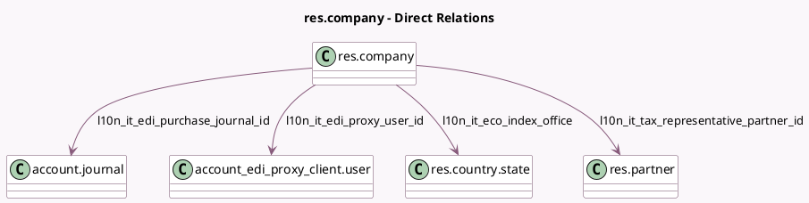

<!-- GENERATED:MODEL -->
---
tags: [odoo, community, generated, model]
---

# res.company

- Module: [[docs/Community Addons/l10n_it_edi/l10n_it_edi|l10n_it_edi]]
- Scope: Community Addons
- Defined in module: extension only
- Source files: `models/res_company.py`
- Python classes: `ResCompany`

## Field footprint

- Detected fields: 13
- Field types: `Boolean` x 3, `Char` x 2, `Float` x 1, `Many2one` x 4, `Selection` x 3
- Relation fields: 4

## Sample fields

- `l10n_it_codice_fiscale`: `Char` (related `partner_id.l10n_it_codice_fiscale`, store `True`)
- `l10n_it_eco_index_liquidation_state`: `Selection`
- `l10n_it_eco_index_number`: `Char`
- `l10n_it_eco_index_office`: `Many2one` (comodel `res.country.state`)
- `l10n_it_eco_index_share_capital`: `Float`
- `l10n_it_eco_index_sole_shareholder`: `Selection`
- `l10n_it_edi_proxy_user_id`: `Many2one` (comodel `account_edi_proxy_client.user`, compute `_compute_l10n_it_edi_proxy_user_id`)
- `l10n_it_edi_purchase_journal_id`: `Many2one` (comodel `account.journal`, compute `_compute_l10n_it_edi_purchase_journal_id`, store `True`)
- `l10n_it_edi_register`: `Boolean`
- `l10n_it_has_eco_index`: `Boolean`
- `l10n_it_has_tax_representative`: `Boolean`
- `l10n_it_tax_representative_partner_id`: `Many2one` (comodel `res.partner`)
- `l10n_it_tax_system`: `Selection`

## Method hints

- Detected methods: 9
- Action methods: none
- Compute methods: `_compute_l10n_it_edi_proxy_user_id`, `_compute_l10n_it_edi_purchase_journal_id`
- Onchange methods: `_onchange_l10n_it_has_tax_represeentative`

## Direct relation diagram

## Navigation

- **Parent:** [[docs/Community Addons/l10n_it_edi/Models]]

<!-- GENERATED:MODEL -->
