<!-- GENERATED:MODEL -->
---
tags: [odoo, community, generated, model]
---

# res.config.settings

- Module: [[docs/Community Addons/l10n_it_edi/l10n_it_edi|l10n_it_edi]]
- Scope: Community Addons
- Defined in module: extension only
- Source files: `models/res_config_settings.py`
- Python classes: `ResConfigSettings`

## Field footprint

- Detected fields: 4
- Field types: `Boolean` x 3, `Many2one` x 1
- Relation fields: 1

## Sample fields

- `l10n_it_edi_purchase_journal_id`: `Many2one` (related `company_id.l10n_it_edi_purchase_journal_id`)
- `l10n_it_edi_register`: `Boolean` (compute `_compute_l10n_it_edi_register`)
- `l10n_it_edi_show_purchase_journal_id`: `Boolean` (compute `_compute_l10n_it_edi_show_purchase_journal_id`)
- `use_root_proxy_user`: `Boolean` (compute `_compute_use_root_proxy_user`)

## Method hints

- Detected methods: 5
- Action methods: none
- Compute methods: `_compute_l10n_it_edi_register`, `_compute_l10n_it_edi_show_purchase_journal_id`, `_compute_use_root_proxy_user`
- Onchange methods: none

## Direct relation diagram

```plantuml
@startuml
!define ODOO_COLOR_PRIMARY #714B67
!define ODOO_COLOR_ACCENT #875A7B
!define ODOO_COLOR_BG #FAF7FA

skinparam backgroundColor ODOO_COLOR_BG
skinparam defaultTextAlignment left
skinparam ArrowColor ODOO_COLOR_ACCENT
skinparam ClassBackgroundColor white
skinparam ClassBorderColor ODOO_COLOR_PRIMARY
skinparam ComponentBackgroundColor white
skinparam ComponentBorderColor ODOO_COLOR_PRIMARY
skinparam NoteBackgroundColor #FFF8FF
skinparam NoteBorderColor ODOO_COLOR_ACCENT
skinparam SequenceLifeLineBorderColor ODOO_COLOR_ACCENT
skinparam SequenceLifeLineBackgroundColor #FFFFFF
skinparam SequenceParticipantBorderColor ODOO_COLOR_PRIMARY
skinparam SequenceParticipantBackgroundColor #FFFFFF
skinparam sequence {
  ArrowColor ODOO_COLOR_ACCENT
  ActorBorderColor ODOO_COLOR_PRIMARY
}
title res.config.settings - Direct Relations
class "res.config.settings" as res_config_settings
@enduml
```

## Navigation

- **Parent:** [[docs/Community Addons/l10n_it_edi/Models]]

<!-- GENERATED:MODEL -->
