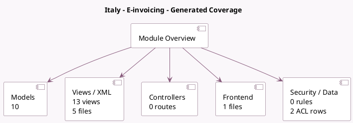

<!-- GENERATED:MODULE -->
---
tags: [odoo, community, module]
---

# Italy - E-invoicing

- Scope: Community Addons
- Source: odoo/addons/l10n_it_edi
- Dependencies: [[docs/Community Addons/l10n_it/l10n_it|l10n_it]], [[docs/Community Addons/account_edi_proxy_client/account_edi_proxy_client|account_edi_proxy_client]], [[docs/Community Addons/account_debit_note/account_debit_note|account_debit_note]]

## Generated coverage

- Models: 10
- XML files with UI/data artifacts: 5
- Views: 13
- Actions: 1
- Menus: 1
- Rules (ir.rule): 0
- Access CSV entries: 2
- Controller units: 0
- Frontend asset files: 1

## Module map

## Detail notes

- Models: [[docs/Community Addons/l10n_it_edi/Models|Models]] (10)
- Views and XML: [[docs/Community Addons/l10n_it_edi/Views|Views]] (5 files)
- Frontend: [[docs/Community Addons/l10n_it_edi/Frontend|Frontend]] (1 files)

## Key models

- `account.move`
- `account.move.send`
- `account.payment.method.line`
- `account.tax`
- `account_edi_proxy_client.user`
- `l10n_it.ddt`
- `l10n_it.document.type`
- `res.company`
- `res.config.settings`
- `res.partner`

## Navigation

- [[../Community Addons/Community Addons|Back to scope]]
- [[../../docs/docs|Back to docs]]

<!-- GENERATED:MODULE -->

