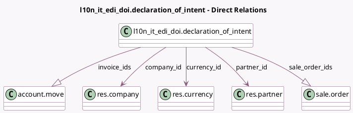

<!-- GENERATED:MODEL -->
---
tags: [odoo, community, generated, model]
---

# l10n_it_edi_doi.declaration_of_intent

- Module: [[docs/Community Addons/l10n_it_edi_doi/l10n_it_edi_doi|l10n_it_edi_doi]]
- Scope: Community Addons
- Defined in module: yes
- Source files: `models/declaration_of_intent.py`
- Python classes: `L10n_It_Edi_DoiDeclaration_Of_Intent`
- Description: Declaration of Intent
- Inherits: `mail.activity.mixin`, `mail.thread.main.attachment`

## Field footprint

- Detected fields: 15
- Field types: `Char` x 2, `Date` x 3, `Many2one` x 3, `Monetary` x 4, `One2many` x 2, `Selection` x 1
- Relation fields: 5

## Sample fields

- `company_id`: `Many2one` (comodel `res.company`)
- `currency_id`: `Many2one` (comodel `res.currency`)
- `end_date`: `Date`
- `invoice_ids`: `One2many` (comodel `account.move`)
- `invoiced`: `Monetary` (compute `_compute_invoiced`, store `True`)
- `issue_date`: `Date`
- `not_yet_invoiced`: `Monetary` (compute `_compute_not_yet_invoiced`, store `True`)
- `partner_id`: `Many2one` (comodel `res.partner`)
- `protocol_number_part1`: `Char`
- `protocol_number_part2`: `Char`
- `remaining`: `Monetary` (compute `_compute_remaining`, store `True`)
- `sale_order_ids`: `One2many` (comodel `sale.order`)
- `start_date`: `Date`
- `state`: `Selection`
- `threshold`: `Monetary`

## Method hints

- Detected methods: 16
- Action methods: `action_open_invoice_ids`, `action_open_sale_order_ids`, `action_reactivate`, `action_reset_to_draft`, `action_revoke`, `action_terminate`, `action_validate`
- Compute methods: `_compute_display_name`, `_compute_invoiced`, `_compute_not_yet_invoiced`, `_compute_remaining`
- Onchange methods: none

## Direct relation diagram

## Navigation

- **Parent:** [[docs/Community Addons/l10n_it_edi_doi/Models]]

<!-- GENERATED:MODEL -->
