<!-- GENERATED:MODEL -->
---
tags: [odoo, community, generated, model]
---

# sale.order

- Module: [[docs/Community Addons/l10n_it_edi_doi/l10n_it_edi_doi|l10n_it_edi_doi]]
- Scope: Community Addons
- Defined in module: extension only
- Source files: `models/sale_order.py`
- Python classes: `SaleOrder`

## Field footprint

- Detected fields: 5
- Field types: `Boolean` x 1, `Date` x 1, `Many2one` x 1, `Monetary` x 1, `Text` x 1
- Relation fields: 1

## Sample fields

- `l10n_it_edi_doi_date`: `Date` (compute `_compute_l10n_it_edi_doi_date`)
- `l10n_it_edi_doi_id`: `Many2one` (comodel `l10n_it_edi_doi.declaration_of_intent`, compute `_compute_l10n_it_edi_doi_id`, store `True`)
- `l10n_it_edi_doi_not_yet_invoiced`: `Monetary` (compute `_compute_l10n_it_edi_doi_not_yet_invoiced`, store `True`)
- `l10n_it_edi_doi_use`: `Boolean` (compute `_compute_l10n_it_edi_doi_use`)
- `l10n_it_edi_doi_warning`: `Text` (compute `_compute_l10n_it_edi_doi_warning`)

## Method hints

- Detected methods: 15
- Action methods: `action_confirm`, `action_open_declaration_of_intent`, `action_quotation_send`, `action_quotation_sent`
- Compute methods: `_compute_fiscal_position_id`, `_compute_l10n_it_edi_doi_date`, `_compute_l10n_it_edi_doi_id`, `_compute_l10n_it_edi_doi_not_yet_invoiced`, `_compute_l10n_it_edi_doi_use`, `_compute_l10n_it_edi_doi_warning`
- Onchange methods: none

## Direct relation diagram

```plantuml
@startuml
!define ODOO_COLOR_PRIMARY #714B67
!define ODOO_COLOR_ACCENT #875A7B
!define ODOO_COLOR_BG #FAF7FA

skinparam backgroundColor ODOO_COLOR_BG
skinparam defaultTextAlignment left
skinparam ArrowColor ODOO_COLOR_ACCENT
skinparam ClassBackgroundColor white
skinparam ClassBorderColor ODOO_COLOR_PRIMARY
skinparam ComponentBackgroundColor white
skinparam ComponentBorderColor ODOO_COLOR_PRIMARY
skinparam NoteBackgroundColor #FFF8FF
skinparam NoteBorderColor ODOO_COLOR_ACCENT
skinparam SequenceLifeLineBorderColor ODOO_COLOR_ACCENT
skinparam SequenceLifeLineBackgroundColor #FFFFFF
skinparam SequenceParticipantBorderColor ODOO_COLOR_PRIMARY
skinparam SequenceParticipantBackgroundColor #FFFFFF
skinparam sequence {
  ArrowColor ODOO_COLOR_ACCENT
  ActorBorderColor ODOO_COLOR_PRIMARY
}
title sale.order - Direct Relations
class "sale.order" as sale_order
class "l10n_it_edi_doi.declaration_of_intent" as l10n_it_edi_doi_declaration_of_intent
sale_order --> l10n_it_edi_doi_declaration_of_intent : l10n_it_edi_doi_id
@enduml
```

## Navigation

- **Parent:** [[docs/Community Addons/l10n_it_edi_doi/Models]]

<!-- GENERATED:MODEL -->
