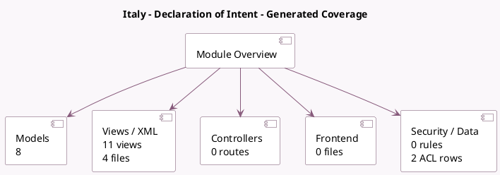

<!-- GENERATED:MODULE -->
---
tags: [odoo, community, module]
---

# Italy - Declaration of Intent

- Scope: Community Addons
- Source: odoo/addons/l10n_it_edi_doi
- Dependencies: [[docs/Community Addons/l10n_it_edi/l10n_it_edi|l10n_it_edi]], [[docs/Community Addons/sale/sale|sale]]

## Generated coverage

- Models: 8
- XML files with UI/data artifacts: 4
- Views: 11
- Actions: 0
- Menus: 0
- Rules (ir.rule): 0
- Access CSV entries: 2
- Controller units: 0
- Frontend asset files: 0

## Module map

## Detail notes

- Models: [[docs/Community Addons/l10n_it_edi_doi/Models|Models]] (8)
- Views and XML: [[docs/Community Addons/l10n_it_edi_doi/Views|Views]] (4 files)

## Key models

- `account.chart.template`
- `account.fiscal.position`
- `account.move`
- `account.tax`
- `l10n_it_edi_doi.declaration_of_intent`
- `res.company`
- `res.partner`
- `sale.order`

## Navigation

- [[../Community Addons/Community Addons|Back to scope]]
- [[../../docs/docs|Back to docs]]

<!-- GENERATED:MODULE -->

