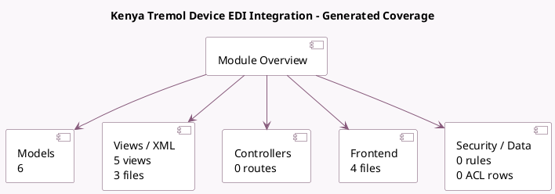

<!-- GENERATED:MODULE -->
---
tags: [odoo, community, module]
---

# Kenya Tremol Device EDI Integration

- Scope: Community Addons
- Source: odoo/addons/l10n_ke_edi_tremol
- Dependencies: [[docs/Community Addons/l10n_ke/l10n_ke|l10n_ke]]

## Summary

Kenya Tremol Device EDI Integration

## Generated coverage

- Models: 6
- XML files with UI/data artifacts: 3
- Views: 5
- Actions: 1
- Menus: 0
- Rules (ir.rule): 0
- Access CSV entries: 0
- Controller units: 0
- Frontend asset files: 4

## Module map

## Detail notes

- Models: [[docs/Community Addons/l10n_ke_edi_tremol/Models|Models]] (6)
- Views and XML: [[docs/Community Addons/l10n_ke_edi_tremol/Views|Views]] (3 files)
- Frontend: [[docs/Community Addons/l10n_ke_edi_tremol/Frontend|Frontend]] (4 files)

## Key models

- `account.move`
- `account.move.send`
- `account.move.send.wizard`
- `res.company`
- `res.config.settings`
- `res.partner`

## Navigation

- [[../Community Addons/Community Addons|Back to scope]]
- [[../../docs/docs|Back to docs]]

<!-- GENERATED:MODULE -->

