<!-- GENERATED:MODEL -->
---
tags: [odoo, community, generated, model]
---

# l10n_latam.identification.type

- Module: [[docs/Community Addons/l10n_latam_base/l10n_latam_base|l10n_latam_base]]
- Scope: Community Addons
- Defined in module: yes
- Source files: `models/l10n_latam_identification_type.py`
- Python classes: `L10n_LatamIdentificationType`
- Description: Identification Types

## Field footprint

- Detected fields: 6
- Field types: `Boolean` x 2, `Char` x 2, `Integer` x 1, `Many2one` x 1
- Relation fields: 1

## Sample fields

- `active`: `Boolean`
- `country_id`: `Many2one` (comodel `res.country`)
- `description`: `Char`
- `is_vat`: `Boolean`
- `name`: `Char`
- `sequence`: `Integer`

## Method hints

- Detected methods: 1
- Action methods: none
- Compute methods: `_compute_display_name`
- Onchange methods: none

## Direct relation diagram

```plantuml
@startuml
!define ODOO_COLOR_PRIMARY #714B67
!define ODOO_COLOR_ACCENT #875A7B
!define ODOO_COLOR_BG #FAF7FA

skinparam backgroundColor ODOO_COLOR_BG
skinparam defaultTextAlignment left
skinparam ArrowColor ODOO_COLOR_ACCENT
skinparam ClassBackgroundColor white
skinparam ClassBorderColor ODOO_COLOR_PRIMARY
skinparam ComponentBackgroundColor white
skinparam ComponentBorderColor ODOO_COLOR_PRIMARY
skinparam NoteBackgroundColor #FFF8FF
skinparam NoteBorderColor ODOO_COLOR_ACCENT
skinparam SequenceLifeLineBorderColor ODOO_COLOR_ACCENT
skinparam SequenceLifeLineBackgroundColor #FFFFFF
skinparam SequenceParticipantBorderColor ODOO_COLOR_PRIMARY
skinparam SequenceParticipantBackgroundColor #FFFFFF
skinparam sequence {
  ArrowColor ODOO_COLOR_ACCENT
  ActorBorderColor ODOO_COLOR_PRIMARY
}
title l10n_latam.identification.type - Direct Relations
class "l10n_latam.identification.type" as l10n_latam_identification_type
class "res.country" as res_country
l10n_latam_identification_type --> res_country : country_id
@enduml
```

## Navigation

- **Parent:** [[docs/Community Addons/l10n_latam_base/Models]]

<!-- GENERATED:MODEL -->
