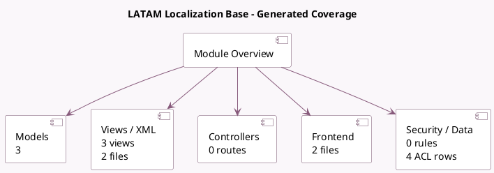

<!-- GENERATED:MODULE -->
---
tags: [odoo, community, module]
---

# LATAM Localization Base

- Scope: Community Addons
- Source: odoo/addons/l10n_latam_base
- Dependencies: [[docs/Community Addons/contacts/contacts|contacts]], [[docs/Community Addons/base_vat/base_vat|base_vat]]

## Summary

LATAM Identification Types

## Generated coverage

- Models: 3
- XML files with UI/data artifacts: 2
- Views: 3
- Actions: 1
- Menus: 1
- Rules (ir.rule): 0
- Access CSV entries: 4
- Controller units: 0
- Frontend asset files: 2

## Module map

## Detail notes

- Models: [[docs/Community Addons/l10n_latam_base/Models|Models]] (3)
- Views and XML: [[docs/Community Addons/l10n_latam_base/Views|Views]] (2 files)
- Frontend: [[docs/Community Addons/l10n_latam_base/Frontend|Frontend]] (2 files)

## Key models

- `l10n_latam.identification.type`
- `res.company`
- `res.partner`

## Navigation

- [[../Community Addons/Community Addons|Back to scope]]
- [[../../docs/docs|Back to docs]]

<!-- GENERATED:MODULE -->

