<!-- GENERATED:MODEL -->
---
tags: [odoo, community, generated, model]
---

# account.payment

- Module: [[docs/Community Addons/l10n_latam_check/l10n_latam_check|l10n_latam_check]]
- Scope: Community Addons
- Defined in module: extension only
- Source files: `models/account_payment.py`
- Python classes: `AccountPayment`

## Field footprint

- Detected fields: 4
- Field types: `Many2many` x 1, `Monetary` x 1, `One2many` x 1, `Text` x 1
- Relation fields: 2

## Sample fields

- `amount`: `Monetary` (compute `_compute_amount`, store `True`)
- `l10n_latam_check_warning_msg`: `Text` (compute `_compute_l10n_latam_check_warning_msg`)
- `l10n_latam_move_check_ids`: `Many2many` (comodel `l10n_latam.check`)
- `l10n_latam_new_check_ids`: `One2many` (comodel `l10n_latam.check`)

## Method hints

- Detected methods: 16
- Action methods: `action_cancel`, `action_draft`, `action_post`
- Compute methods: `_compute_amount`, `_compute_destination_account_id`, `_compute_l10n_latam_check_warning_msg`
- Onchange methods: none

## Direct relation diagram

```plantuml
@startuml
!define ODOO_COLOR_PRIMARY #714B67
!define ODOO_COLOR_ACCENT #875A7B
!define ODOO_COLOR_BG #FAF7FA

skinparam backgroundColor ODOO_COLOR_BG
skinparam defaultTextAlignment left
skinparam ArrowColor ODOO_COLOR_ACCENT
skinparam ClassBackgroundColor white
skinparam ClassBorderColor ODOO_COLOR_PRIMARY
skinparam ComponentBackgroundColor white
skinparam ComponentBorderColor ODOO_COLOR_PRIMARY
skinparam NoteBackgroundColor #FFF8FF
skinparam NoteBorderColor ODOO_COLOR_ACCENT
skinparam SequenceLifeLineBorderColor ODOO_COLOR_ACCENT
skinparam SequenceLifeLineBackgroundColor #FFFFFF
skinparam SequenceParticipantBorderColor ODOO_COLOR_PRIMARY
skinparam SequenceParticipantBackgroundColor #FFFFFF
skinparam sequence {
  ArrowColor ODOO_COLOR_ACCENT
  ActorBorderColor ODOO_COLOR_PRIMARY
}
title account.payment - Direct Relations
class "account.payment" as account_payment
class "l10n_latam.check" as l10n_latam_check
account_payment --|> l10n_latam_check : l10n_latam_new_check_ids
account_payment .. l10n_latam_check : l10n_latam_move_check_ids
@enduml
```

## Navigation

- **Parent:** [[docs/Community Addons/l10n_latam_check/Models]]

<!-- GENERATED:MODEL -->
