<!-- GENERATED:MODEL -->
---
tags: [odoo, community, generated, model]
---

# account.payment.register

- Module: [[docs/Community Addons/l10n_latam_check/l10n_latam_check|l10n_latam_check]]
- Scope: Community Addons
- Defined in module: extension only
- Source files: `wizards/account_payment_register.py`
- Python classes: `AccountPaymentRegister`

## Field footprint

- Detected fields: 2
- Field types: `Many2many` x 1, `One2many` x 1
- Relation fields: 2

## Sample fields

- `l10n_latam_move_check_ids`: `Many2many` (comodel `l10n_latam.check`)
- `l10n_latam_new_check_ids`: `One2many` (comodel `l10n_latam.payment.register.check`)

## Method hints

- Detected methods: 5
- Action methods: `action_create_payments`
- Compute methods: `_compute_amount`, `_compute_currency_id`
- Onchange methods: none

## Direct relation diagram

```plantuml
@startuml
!define ODOO_COLOR_PRIMARY #714B67
!define ODOO_COLOR_ACCENT #875A7B
!define ODOO_COLOR_BG #FAF7FA

skinparam backgroundColor ODOO_COLOR_BG
skinparam defaultTextAlignment left
skinparam ArrowColor ODOO_COLOR_ACCENT
skinparam ClassBackgroundColor white
skinparam ClassBorderColor ODOO_COLOR_PRIMARY
skinparam ComponentBackgroundColor white
skinparam ComponentBorderColor ODOO_COLOR_PRIMARY
skinparam NoteBackgroundColor #FFF8FF
skinparam NoteBorderColor ODOO_COLOR_ACCENT
skinparam SequenceLifeLineBorderColor ODOO_COLOR_ACCENT
skinparam SequenceLifeLineBackgroundColor #FFFFFF
skinparam SequenceParticipantBorderColor ODOO_COLOR_PRIMARY
skinparam SequenceParticipantBackgroundColor #FFFFFF
skinparam sequence {
  ArrowColor ODOO_COLOR_ACCENT
  ActorBorderColor ODOO_COLOR_PRIMARY
}
title account.payment.register - Direct Relations
class "account.payment.register" as account_payment_register
class "l10n_latam.check" as l10n_latam_check
class "l10n_latam.payment.register.check" as l10n_latam_payment_register_check
account_payment_register --|> l10n_latam_payment_register_check : l10n_latam_new_check_ids
account_payment_register .. l10n_latam_check : l10n_latam_move_check_ids
@enduml
```

## Navigation

- **Parent:** [[docs/Community Addons/l10n_latam_check/Models]]

<!-- GENERATED:MODEL -->
