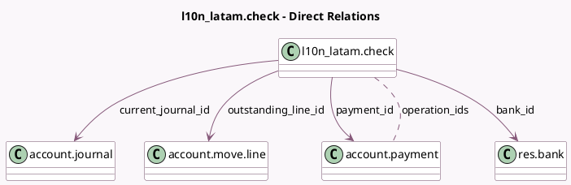

<!-- GENERATED:MODEL -->
---
tags: [odoo, community, generated, model]
---

# l10n_latam.check

- Module: [[docs/Community Addons/l10n_latam_check/l10n_latam_check|l10n_latam_check]]
- Scope: Community Addons
- Defined in module: yes
- Source files: `models/l10n_latam_check.py`
- Python classes: `L10n_LatamCheck`
- Description: Account payment check
- Inherits: `mail.activity.mixin`, `mail.thread`

## Field footprint

- Detected fields: 16
- Field types: `Char` x 3, `Date` x 1, `Many2many` x 1, `Many2one` x 9, `Monetary` x 1, `Selection` x 1
- Relation fields: 10

## Sample fields

- `amount`: `Monetary`
- `bank_id`: `Many2one` (comodel `res.bank`, compute `_compute_bank_id`, store `True`)
- `company_id`: `Many2one` (related `payment_id.company_id`, store `True`)
- `currency_id`: `Many2one` (related `payment_id.currency_id`)
- `current_journal_id`: `Many2one` (comodel `account.journal`, compute `_compute_current_journal`, store `True`)
- `issue_state`: `Selection` (compute `_compute_issue_state`, store `True`)
- `issuer_vat`: `Char` (compute `_compute_issuer_vat`, store `True`)
- `name`: `Char`
- `operation_ids`: `Many2many` (comodel `account.payment`)
- `original_journal_id`: `Many2one` (related `payment_id.journal_id`)
- `outstanding_line_id`: `Many2one` (comodel `account.move.line`)
- `partner_id`: `Many2one` (related `payment_id.partner_id`)
- `payment_date`: `Date`
- `payment_id`: `Many2one` (comodel `account.payment`)
- `payment_method_code`: `Char` (related `payment_id.payment_method_code`)
- `payment_method_line_id`: `Many2one` (related `payment_id.payment_method_line_id`, store `True`)

## Method hints

- Detected methods: 17
- Action methods: `action_show_journal_entry`, `action_show_reconciled_move`, `action_void`
- Compute methods: `_compute_bank_id`, `_compute_current_journal`, `_compute_issue_state`, `_compute_issuer_vat`
- Onchange methods: `_clean_issuer_vat`, `_onchange_name`

## Direct relation diagram

## Navigation

- **Parent:** [[docs/Community Addons/l10n_latam_check/Models]]

<!-- GENERATED:MODEL -->
