<!-- GENERATED:MODEL -->
---
tags: [odoo, community, generated, model]
---

# l10n_latam.payment.mass.transfer

- Module: [[docs/Community Addons/l10n_latam_check/l10n_latam_check|l10n_latam_check]]
- Scope: Community Addons
- Defined in module: yes
- Source files: `wizards/l10n_latam_payment_mass_transfer.py`
- Python classes: `L10n_LatamPaymentMassTransfer`
- Description: Checks Mass Transfers

## Field footprint

- Detected fields: 6
- Field types: `Char` x 1, `Date` x 1, `Many2many` x 1, `Many2one` x 3
- Relation fields: 4

## Sample fields

- `check_ids`: `Many2many` (comodel `l10n_latam.check`)
- `communication`: `Char`
- `company_id`: `Many2one` (comodel `res.company`, compute `_compute_journal_company`)
- `destination_journal_id`: `Many2one` (comodel `account.journal`)
- `journal_id`: `Many2one` (comodel `account.journal`, compute `_compute_journal_company`)
- `payment_date`: `Date`

## Method hints

- Detected methods: 4
- Action methods: `action_create_payments`
- Compute methods: `_compute_journal_company`
- Onchange methods: none

## Direct relation diagram

```plantuml
@startuml
!define ODOO_COLOR_PRIMARY #714B67
!define ODOO_COLOR_ACCENT #875A7B
!define ODOO_COLOR_BG #FAF7FA

skinparam backgroundColor ODOO_COLOR_BG
skinparam defaultTextAlignment left
skinparam ArrowColor ODOO_COLOR_ACCENT
skinparam ClassBackgroundColor white
skinparam ClassBorderColor ODOO_COLOR_PRIMARY
skinparam ComponentBackgroundColor white
skinparam ComponentBorderColor ODOO_COLOR_PRIMARY
skinparam NoteBackgroundColor #FFF8FF
skinparam NoteBorderColor ODOO_COLOR_ACCENT
skinparam SequenceLifeLineBorderColor ODOO_COLOR_ACCENT
skinparam SequenceLifeLineBackgroundColor #FFFFFF
skinparam SequenceParticipantBorderColor ODOO_COLOR_PRIMARY
skinparam SequenceParticipantBackgroundColor #FFFFFF
skinparam sequence {
  ArrowColor ODOO_COLOR_ACCENT
  ActorBorderColor ODOO_COLOR_PRIMARY
}
title l10n_latam.payment.mass.transfer - Direct Relations
class "l10n_latam.payment.mass.transfer" as l10n_latam_payment_mass_transfer
class "account.journal" as account_journal
class "l10n_latam.check" as l10n_latam_check
class "res.company" as res_company
l10n_latam_payment_mass_transfer --> account_journal : destination_journal_id
l10n_latam_payment_mass_transfer --> account_journal : journal_id
l10n_latam_payment_mass_transfer --> res_company : company_id
l10n_latam_payment_mass_transfer .. l10n_latam_check : check_ids
@enduml
```

## Navigation

- **Parent:** [[docs/Community Addons/l10n_latam_check/Models]]

<!-- GENERATED:MODEL -->
