<!-- GENERATED:MODEL -->
---
tags: [odoo, community, generated, model]
---

# l10n_latam.payment.register.check

- Module: [[docs/Community Addons/l10n_latam_check/l10n_latam_check|l10n_latam_check]]
- Scope: Community Addons
- Defined in module: yes
- Source files: `wizards/l10n_latam_payment_register_check.py`
- Python classes: `L10n_LatamPaymentRegisterCheck`
- Description: Payment register check

## Field footprint

- Detected fields: 8
- Field types: `Char` x 2, `Date` x 1, `Many2one` x 4, `Monetary` x 1
- Relation fields: 4

## Sample fields

- `amount`: `Monetary`
- `bank_id`: `Many2one` (comodel `res.bank`, compute `_compute_bank_id`, store `True`)
- `company_id`: `Many2one` (related `payment_register_id.company_id`)
- `currency_id`: `Many2one` (related `payment_register_id.currency_id`)
- `issuer_vat`: `Char` (compute `_compute_issuer_vat`, store `True`)
- `name`: `Char`
- `payment_date`: `Date`
- `payment_register_id`: `Many2one` (comodel `account.payment.register`)

## Method hints

- Detected methods: 4
- Action methods: none
- Compute methods: `_compute_bank_id`, `_compute_issuer_vat`
- Onchange methods: `_clean_issuer_vat`, `_onchange_name`

## Direct relation diagram

```plantuml
@startuml
!define ODOO_COLOR_PRIMARY #714B67
!define ODOO_COLOR_ACCENT #875A7B
!define ODOO_COLOR_BG #FAF7FA

skinparam backgroundColor ODOO_COLOR_BG
skinparam defaultTextAlignment left
skinparam ArrowColor ODOO_COLOR_ACCENT
skinparam ClassBackgroundColor white
skinparam ClassBorderColor ODOO_COLOR_PRIMARY
skinparam ComponentBackgroundColor white
skinparam ComponentBorderColor ODOO_COLOR_PRIMARY
skinparam NoteBackgroundColor #FFF8FF
skinparam NoteBorderColor ODOO_COLOR_ACCENT
skinparam SequenceLifeLineBorderColor ODOO_COLOR_ACCENT
skinparam SequenceLifeLineBackgroundColor #FFFFFF
skinparam SequenceParticipantBorderColor ODOO_COLOR_PRIMARY
skinparam SequenceParticipantBackgroundColor #FFFFFF
skinparam sequence {
  ArrowColor ODOO_COLOR_ACCENT
  ActorBorderColor ODOO_COLOR_PRIMARY
}
title l10n_latam.payment.register.check - Direct Relations
class "l10n_latam.payment.register.check" as l10n_latam_payment_register_check
class "account.payment.register" as account_payment_register
class "res.bank" as res_bank
l10n_latam_payment_register_check --> account_payment_register : payment_register_id
l10n_latam_payment_register_check --> res_bank : bank_id
@enduml
```

## Navigation

- **Parent:** [[docs/Community Addons/l10n_latam_check/Models]]

<!-- GENERATED:MODEL -->
