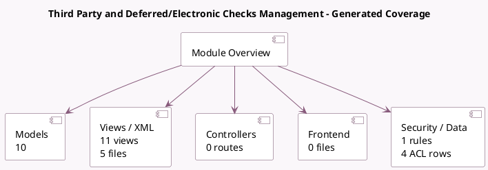

<!-- GENERATED:MODULE -->
---
tags: [odoo, community, module]
---

# Third Party and Deferred/Electronic Checks Management

- Scope: Community Addons
- Source: odoo/addons/l10n_latam_check
- Dependencies: [[docs/Community Addons/account/account|account]], [[docs/Community Addons/base_vat/base_vat|base_vat]]

## Summary

Checks Management

## Generated coverage

- Models: 10
- XML files with UI/data artifacts: 5
- Views: 11
- Actions: 3
- Menus: 2
- Rules (ir.rule): 1
- Access CSV entries: 4
- Controller units: 0
- Frontend asset files: 0

## Module map

## Detail notes

- Models: [[docs/Community Addons/l10n_latam_check/Models|Models]] (10)
- Views and XML: [[docs/Community Addons/l10n_latam_check/Views|Views]] (5 files)

## Key models

- `account.chart.template`
- `account.journal`
- `account.move`
- `account.move.line`
- `account.payment`
- `account.payment.method`
- `account.payment.register`
- `l10n_latam.check`
- `l10n_latam.payment.mass.transfer`
- `l10n_latam.payment.register.check`

## Navigation

- [[../Community Addons/Community Addons|Back to scope]]
- [[../../docs/docs|Back to docs]]

<!-- GENERATED:MODULE -->

