<!-- GENERATED:MODEL -->
---
tags: [odoo, community, generated, model]
---

# account.move

- Module: [[docs/Community Addons/l10n_latam_invoice_document/l10n_latam_invoice_document|l10n_latam_invoice_document]]
- Scope: Community Addons
- Defined in module: extension only
- Source files: `models/account_move.py`
- Python classes: `AccountMove`

## Field footprint

- Detected fields: 6
- Field types: `Boolean` x 2, `Char` x 2, `Many2many` x 1, `Many2one` x 1
- Relation fields: 2

## Sample fields

- `l10n_latam_available_document_type_ids`: `Many2many` (comodel `l10n_latam.document.type`, compute `_compute_l10n_latam_available_document_types`)
- `l10n_latam_document_number`: `Char` (compute `_compute_l10n_latam_document_number`)
- `l10n_latam_document_type_id`: `Many2one` (comodel `l10n_latam.document.type`, compute `_compute_l10n_latam_document_type`, store `True`)
- `l10n_latam_document_type_id_code`: `Char` (related `l10n_latam_document_type_id.code`)
- `l10n_latam_manual_document_number`: `Boolean` (compute `_compute_l10n_latam_manual_document_number`)
- `l10n_latam_use_documents`: `Boolean` (compute `_compute_l10n_latam_use_documents`)

## Method hints

- Detected methods: 22
- Action methods: none
- Compute methods: `_compute_highest_name`, `_compute_l10n_latam_available_document_types`, `_compute_l10n_latam_document_number`, `_compute_l10n_latam_document_type`, `_compute_l10n_latam_manual_document_number`, `_compute_l10n_latam_use_documents`, `_compute_made_sequence_gap`, `_compute_name`, and 1 more
- Onchange methods: `_inverse_l10n_latam_document_number`, `_onchange_l10n_latam_document_type_id`

## Direct relation diagram

```plantuml
@startuml
!define ODOO_COLOR_PRIMARY #714B67
!define ODOO_COLOR_ACCENT #875A7B
!define ODOO_COLOR_BG #FAF7FA

skinparam backgroundColor ODOO_COLOR_BG
skinparam defaultTextAlignment left
skinparam ArrowColor ODOO_COLOR_ACCENT
skinparam ClassBackgroundColor white
skinparam ClassBorderColor ODOO_COLOR_PRIMARY
skinparam ComponentBackgroundColor white
skinparam ComponentBorderColor ODOO_COLOR_PRIMARY
skinparam NoteBackgroundColor #FFF8FF
skinparam NoteBorderColor ODOO_COLOR_ACCENT
skinparam SequenceLifeLineBorderColor ODOO_COLOR_ACCENT
skinparam SequenceLifeLineBackgroundColor #FFFFFF
skinparam SequenceParticipantBorderColor ODOO_COLOR_PRIMARY
skinparam SequenceParticipantBackgroundColor #FFFFFF
skinparam sequence {
  ArrowColor ODOO_COLOR_ACCENT
  ActorBorderColor ODOO_COLOR_PRIMARY
}
title account.move - Direct Relations
class "account.move" as account_move
class "l10n_latam.document.type" as l10n_latam_document_type
account_move .. l10n_latam_document_type : l10n_latam_available_document_type_ids
account_move --> l10n_latam_document_type : l10n_latam_document_type_id
@enduml
```

## Navigation

- **Parent:** [[docs/Community Addons/l10n_latam_invoice_document/Models]]

<!-- GENERATED:MODEL -->
