<!-- GENERATED:MODEL -->
---
tags: [odoo, community, generated, model]
---

# account.move.reversal

- Module: [[docs/Community Addons/l10n_latam_invoice_document/l10n_latam_invoice_document|l10n_latam_invoice_document]]
- Scope: Community Addons
- Defined in module: extension only
- Source files: `wizards/account_move_reversal.py`
- Python classes: `AccountMoveReversal`

## Field footprint

- Detected fields: 5
- Field types: `Boolean` x 2, `Char` x 1, `Many2many` x 1, `Many2one` x 1
- Relation fields: 2

## Sample fields

- `l10n_latam_available_document_type_ids`: `Many2many` (comodel `l10n_latam.document.type`, compute `_compute_documents_info`)
- `l10n_latam_document_number`: `Char`
- `l10n_latam_document_type_id`: `Many2one` (comodel `l10n_latam.document.type`, compute `_compute_document_type`, store `True`)
- `l10n_latam_manual_document_number`: `Boolean` (compute `_compute_l10n_latam_manual_document_number`)
- `l10n_latam_use_documents`: `Boolean` (compute `_compute_documents_info`)

## Method hints

- Detected methods: 6
- Action methods: none
- Compute methods: `_compute_document_type`, `_compute_documents_info`, `_compute_l10n_latam_manual_document_number`
- Onchange methods: `_onchange_l10n_latam_document_number`

## Direct relation diagram

```plantuml
@startuml
!define ODOO_COLOR_PRIMARY #714B67
!define ODOO_COLOR_ACCENT #875A7B
!define ODOO_COLOR_BG #FAF7FA

skinparam backgroundColor ODOO_COLOR_BG
skinparam defaultTextAlignment left
skinparam ArrowColor ODOO_COLOR_ACCENT
skinparam ClassBackgroundColor white
skinparam ClassBorderColor ODOO_COLOR_PRIMARY
skinparam ComponentBackgroundColor white
skinparam ComponentBorderColor ODOO_COLOR_PRIMARY
skinparam NoteBackgroundColor #FFF8FF
skinparam NoteBorderColor ODOO_COLOR_ACCENT
skinparam SequenceLifeLineBorderColor ODOO_COLOR_ACCENT
skinparam SequenceLifeLineBackgroundColor #FFFFFF
skinparam SequenceParticipantBorderColor ODOO_COLOR_PRIMARY
skinparam SequenceParticipantBackgroundColor #FFFFFF
skinparam sequence {
  ArrowColor ODOO_COLOR_ACCENT
  ActorBorderColor ODOO_COLOR_PRIMARY
}
title account.move.reversal - Direct Relations
class "account.move.reversal" as account_move_reversal
class "l10n_latam.document.type" as l10n_latam_document_type
account_move_reversal --> l10n_latam_document_type : l10n_latam_document_type_id
account_move_reversal .. l10n_latam_document_type : l10n_latam_available_document_type_ids
@enduml
```

## Navigation

- **Parent:** [[docs/Community Addons/l10n_latam_invoice_document/Models]]

<!-- GENERATED:MODEL -->
