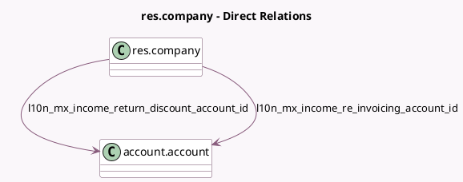

<!-- GENERATED:MODEL -->
---
tags: [odoo, community, generated, model]
---

# res.company

- Module: [[docs/Community Addons/l10n_mx/l10n_mx|l10n_mx]]
- Scope: Community Addons
- Defined in module: extension only
- Source files: `models/res_company.py`
- Python classes: `ResCompany`

## Field footprint

- Detected fields: 2
- Field types: `Many2one` x 2
- Relation fields: 2

## Sample fields

- `l10n_mx_income_re_invoicing_account_id`: `Many2one` (comodel `account.account`)
- `l10n_mx_income_return_discount_account_id`: `Many2one` (comodel `account.account`)

## Method hints

- Detected methods: 0
- Action methods: none
- Compute methods: none
- Onchange methods: none

## Direct relation diagram

## Navigation

- **Parent:** [[docs/Community Addons/l10n_mx/Models]]

<!-- GENERATED:MODEL -->
