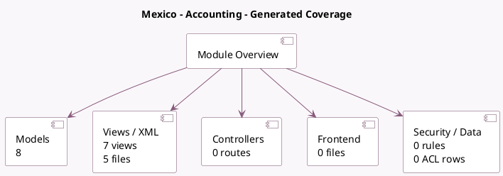

<!-- GENERATED:MODULE -->
---
tags: [odoo, community, module]
---

# Mexico - Accounting

- Scope: Community Addons
- Source: odoo/addons/l10n_mx
- Dependencies: [[docs/Community Addons/account/account|account]]

## Generated coverage

- Models: 8
- XML files with UI/data artifacts: 5
- Views: 7
- Actions: 0
- Menus: 0
- Rules (ir.rule): 0
- Access CSV entries: 0
- Controller units: 0
- Frontend asset files: 0

## Module map

## Detail notes

- Models: [[docs/Community Addons/l10n_mx/Models|Models]] (8)
- Views and XML: [[docs/Community Addons/l10n_mx/Views|Views]] (5 files)

## Key models

- `account.account`
- `account.chart.template`
- `account.move.line`
- `account.tax`
- `res.bank`
- `res.company`
- `res.config.settings`
- `res.partner.bank`

## Navigation

- [[../Community Addons/Community Addons|Back to scope]]
- [[../../docs/docs|Back to docs]]

<!-- GENERATED:MODULE -->

