<!-- GENERATED:MODEL -->
---
tags: [odoo, community, generated, model]
---

# account.move

- Module: [[docs/Community Addons/l10n_my_edi/l10n_my_edi|l10n_my_edi]]
- Scope: Community Addons
- Defined in module: extension only
- Source files: `models/account_move.py`
- Python classes: `AccountMove`

## Field footprint

- Detected fields: 6
- Field types: `Boolean` x 2, `Char` x 2, `Many2many` x 1, `Selection` x 1
- Relation fields: 1

## Sample fields

- `l10n_my_edi_custom_form_reference`: `Char`
- `l10n_my_edi_display_tax_exemption_reason`: `Boolean` (compute `_compute_l10n_my_edi_display_tax_exemption_reason`)
- `l10n_my_edi_document_ids`: `Many2many` (comodel `myinvois.document`)
- `l10n_my_edi_exemption_reason`: `Char`
- `l10n_my_edi_state`: `Selection` (compute `_compute_l10n_my_edi_state`, store `True`)
- `l10n_my_invoice_need_edi`: `Boolean` (compute `_compute_l10n_my_invoice_need_edi`)

## Method hints

- Detected methods: 19
- Action methods: `action_invoice_sent`, `action_l10n_my_edi_send_invoice`, `action_l10n_my_edi_update_status`, `action_show_myinvois_documents`
- Compute methods: `_compute_highlight_send_button`, `_compute_l10n_my_edi_display_tax_exemption_reason`, `_compute_l10n_my_edi_state`, `_compute_l10n_my_invoice_need_edi`, `_compute_need_cancel_request`, `_compute_show_reset_to_draft_button`
- Onchange methods: none

## Direct relation diagram

```plantuml
@startuml
!define ODOO_COLOR_PRIMARY #714B67
!define ODOO_COLOR_ACCENT #875A7B
!define ODOO_COLOR_BG #FAF7FA

skinparam backgroundColor ODOO_COLOR_BG
skinparam defaultTextAlignment left
skinparam ArrowColor ODOO_COLOR_ACCENT
skinparam ClassBackgroundColor white
skinparam ClassBorderColor ODOO_COLOR_PRIMARY
skinparam ComponentBackgroundColor white
skinparam ComponentBorderColor ODOO_COLOR_PRIMARY
skinparam NoteBackgroundColor #FFF8FF
skinparam NoteBorderColor ODOO_COLOR_ACCENT
skinparam SequenceLifeLineBorderColor ODOO_COLOR_ACCENT
skinparam SequenceLifeLineBackgroundColor #FFFFFF
skinparam SequenceParticipantBorderColor ODOO_COLOR_PRIMARY
skinparam SequenceParticipantBackgroundColor #FFFFFF
skinparam sequence {
  ArrowColor ODOO_COLOR_ACCENT
  ActorBorderColor ODOO_COLOR_PRIMARY
}
title account.move - Direct Relations
class "account.move" as account_move
class "myinvois.document" as myinvois_document
account_move .. myinvois_document : l10n_my_edi_document_ids
@enduml
```

## Navigation

- **Parent:** [[docs/Community Addons/l10n_my_edi/Models]]

<!-- GENERATED:MODEL -->
