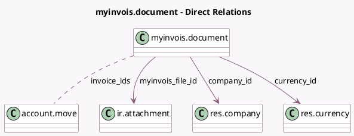

<!-- GENERATED:MODEL -->
---
tags: [odoo, community, generated, model]
---

# myinvois.document

- Module: [[docs/Community Addons/l10n_my_edi/l10n_my_edi|l10n_my_edi]]
- Scope: Community Addons
- Defined in module: yes
- Source files: `models/myinvois_document.py`
- Python classes: `MyInvoisDocument`
- Description: MyInvois Document
- Inherits: `mail.activity.mixin`, `mail.thread`, `sequence.mixin`

## Field footprint

- Detected fields: 18
- Field types: `Binary` x 1, `Boolean` x 1, `Char` x 8, `Date` x 1, `Datetime` x 1, `Many2many` x 1, `Many2one` x 4, `Selection` x 1
- Relation fields: 5

## Sample fields

- `active`: `Boolean`
- `company_currency_id`: `Many2one` (related `company_id.currency_id`)
- `company_id`: `Many2one` (comodel `res.company`)
- `currency_id`: `Many2one` (comodel `res.currency`)
- `invoice_ids`: `Many2many` (comodel `account.move`)
- `myinvois_custom_form_reference`: `Char`
- `myinvois_document_long_id`: `Char`
- `myinvois_error_document_hash`: `Char`
- `myinvois_exemption_reason`: `Char`
- `myinvois_external_uuid`: `Char`
- `myinvois_file`: `Binary`
- `myinvois_file_id`: `Many2one` (comodel `ir.attachment`)
- `myinvois_issuance_date`: `Date`
- `myinvois_retry_at`: `Char`
- `myinvois_state`: `Selection`
- `myinvois_submission_uid`: `Char`
- `myinvois_validation_time`: `Datetime`
- `name`: `Char` (compute `_compute_name`, store `True`)

## Method hints

- Detected methods: 38
- Action methods: `action_cancel_submission`, `action_generate_xml_file`, `action_show_myinvois_documents`, `action_submit_to_myinvois`, `action_update_submission_status`
- Compute methods: `_compute_display_name`, `_compute_linked_attachment_id`, `_compute_name`
- Onchange methods: none

## Direct relation diagram

## Navigation

- **Parent:** [[docs/Community Addons/l10n_my_edi/Models]]

<!-- GENERATED:MODEL -->
