<!-- GENERATED:MODEL -->
---
tags: [odoo, community, generated, model]
---

# res.company

- Module: [[docs/Community Addons/l10n_my_edi/l10n_my_edi|l10n_my_edi]]
- Scope: Community Addons
- Defined in module: extension only
- Source files: `models/res_company.py`
- Python classes: `ResCompany`

## Field footprint

- Detected fields: 7
- Field types: `Char` x 2, `Many2one` x 3, `Selection` x 2
- Relation fields: 3

## Sample fields

- `l10n_my_edi_default_import_journal_id`: `Many2one` (comodel `account.journal`)
- `l10n_my_edi_industrial_classification`: `Many2one` (related `partner_id.l10n_my_edi_industrial_classification`)
- `l10n_my_edi_mode`: `Selection`
- `l10n_my_edi_proxy_user_id`: `Many2one` (comodel `account_edi_proxy_client.user`, compute `_compute_l10n_my_edi_proxy_user_id`)
- `l10n_my_identification_number`: `Char` (related `partner_id.l10n_my_identification_number`)
- `l10n_my_identification_number_placeholder`: `Char` (compute `_compute_l10n_my_identification_number_placeholder`)
- `l10n_my_identification_type`: `Selection` (related `partner_id.l10n_my_identification_type`)

## Method hints

- Detected methods: 4
- Action methods: none
- Compute methods: `_compute_l10n_my_edi_proxy_user_id`, `_compute_l10n_my_identification_number_placeholder`
- Onchange methods: none

## Direct relation diagram

```plantuml
@startuml
!define ODOO_COLOR_PRIMARY #714B67
!define ODOO_COLOR_ACCENT #875A7B
!define ODOO_COLOR_BG #FAF7FA

skinparam backgroundColor ODOO_COLOR_BG
skinparam defaultTextAlignment left
skinparam ArrowColor ODOO_COLOR_ACCENT
skinparam ClassBackgroundColor white
skinparam ClassBorderColor ODOO_COLOR_PRIMARY
skinparam ComponentBackgroundColor white
skinparam ComponentBorderColor ODOO_COLOR_PRIMARY
skinparam NoteBackgroundColor #FFF8FF
skinparam NoteBorderColor ODOO_COLOR_ACCENT
skinparam SequenceLifeLineBorderColor ODOO_COLOR_ACCENT
skinparam SequenceLifeLineBackgroundColor #FFFFFF
skinparam SequenceParticipantBorderColor ODOO_COLOR_PRIMARY
skinparam SequenceParticipantBackgroundColor #FFFFFF
skinparam sequence {
  ArrowColor ODOO_COLOR_ACCENT
  ActorBorderColor ODOO_COLOR_PRIMARY
}
title res.company - Direct Relations
class "res.company" as res_company
class "account.journal" as account_journal
class "account_edi_proxy_client.user" as account_edi_proxy_client_user
res_company --> account_edi_proxy_client_user : l10n_my_edi_proxy_user_id
res_company --> account_journal : l10n_my_edi_default_import_journal_id
@enduml
```

## Navigation

- **Parent:** [[docs/Community Addons/l10n_my_edi/Models]]

<!-- GENERATED:MODEL -->
