<!-- GENERATED:MODEL -->
---
tags: [odoo, community, generated, model]
---

# res.partner

- Module: [[docs/Community Addons/l10n_my_edi/l10n_my_edi|l10n_my_edi]]
- Scope: Community Addons
- Defined in module: extension only
- Source files: `models/res_partner.py`
- Python classes: `ResPartner`

## Field footprint

- Detected fields: 7
- Field types: `Boolean` x 1, `Char` x 3, `Many2one` x 1, `Selection` x 2
- Relation fields: 1

## Sample fields

- `l10n_my_edi_display_tin_warning`: `Boolean` (compute `_compute_l10n_my_edi_display_tin_warning`)
- `l10n_my_edi_industrial_classification`: `Many2one` (comodel `l10n_my_edi.industry_classification`, compute `_compute_l10n_my_edi_industrial_classification`, store `True`)
- `l10n_my_edi_malaysian_tin`: `Char`
- `l10n_my_identification_number`: `Char`
- `l10n_my_identification_number_placeholder`: `Char` (compute `_compute_l10n_my_identification_number_placeholder`)
- `l10n_my_identification_type`: `Selection`
- `l10n_my_tin_validation_state`: `Selection` (compute `_compute_l10n_my_tin_validation_state`, store `True`)

## Method hints

- Detected methods: 8
- Action methods: `action_validate_tin`
- Compute methods: `_compute_l10n_my_edi_display_tin_warning`, `_compute_l10n_my_edi_industrial_classification`, `_compute_l10n_my_identification_number_placeholder`, `_compute_l10n_my_tin_validation_state`
- Onchange methods: none

## Direct relation diagram

```plantuml
@startuml
!define ODOO_COLOR_PRIMARY #714B67
!define ODOO_COLOR_ACCENT #875A7B
!define ODOO_COLOR_BG #FAF7FA

skinparam backgroundColor ODOO_COLOR_BG
skinparam defaultTextAlignment left
skinparam ArrowColor ODOO_COLOR_ACCENT
skinparam ClassBackgroundColor white
skinparam ClassBorderColor ODOO_COLOR_PRIMARY
skinparam ComponentBackgroundColor white
skinparam ComponentBorderColor ODOO_COLOR_PRIMARY
skinparam NoteBackgroundColor #FFF8FF
skinparam NoteBorderColor ODOO_COLOR_ACCENT
skinparam SequenceLifeLineBorderColor ODOO_COLOR_ACCENT
skinparam SequenceLifeLineBackgroundColor #FFFFFF
skinparam SequenceParticipantBorderColor ODOO_COLOR_PRIMARY
skinparam SequenceParticipantBackgroundColor #FFFFFF
skinparam sequence {
  ArrowColor ODOO_COLOR_ACCENT
  ActorBorderColor ODOO_COLOR_PRIMARY
}
title res.partner - Direct Relations
class "res.partner" as res_partner
class "l10n_my_edi.industry_classification" as l10n_my_edi_industry_classification
res_partner --> l10n_my_edi_industry_classification : l10n_my_edi_industrial_classification
@enduml
```

## Navigation

- **Parent:** [[docs/Community Addons/l10n_my_edi/Models]]

<!-- GENERATED:MODEL -->
