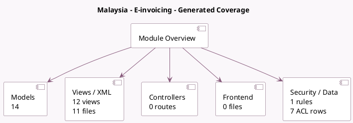

<!-- GENERATED:MODULE -->
---
tags: [odoo, community, module]
---

# Malaysia - E-invoicing

- Scope: Community Addons
- Source: odoo/addons/l10n_my_edi
- Dependencies: [[docs/Community Addons/l10n_my/l10n_my|l10n_my]], [[docs/Community Addons/l10n_my_ubl_pint/l10n_my_ubl_pint|l10n_my_ubl_pint]], [[docs/Community Addons/account_edi_proxy_client/account_edi_proxy_client|account_edi_proxy_client]]

## Summary

E-invoicing using MyInvois

## Generated coverage

- Models: 14
- XML files with UI/data artifacts: 11
- Views: 12
- Actions: 2
- Menus: 0
- Rules (ir.rule): 1
- Access CSV entries: 7
- Controller units: 0
- Frontend asset files: 0

## Module map

## Detail notes

- Models: [[docs/Community Addons/l10n_my_edi/Models|Models]] (14)
- Views and XML: [[docs/Community Addons/l10n_my_edi/Views|Views]] (11 files)

## Key models

- `account.edi.xml.ubl_myinvois_my`
- `account.move`
- `account.move.line`
- `account.move.send`
- `account.tax`
- `account_edi_proxy_client.user`
- `l10n_my_edi.industry_classification`
- `myinvois.consolidate.invoice.wizard`
- `myinvois.document`
- `myinvois.document.status.update.wizard`
- `product.template`
- `res.company`

## Navigation

- [[../Community Addons/Community Addons|Back to scope]]
- [[../../docs/docs|Back to docs]]

<!-- GENERATED:MODULE -->

