<!-- GENERATED:MODEL -->
---
tags: [odoo, community, generated, model]
---

# myinvois.document

- Module: [[docs/Community Addons/l10n_my_edi_pos/l10n_my_edi_pos|l10n_my_edi_pos]]
- Scope: Community Addons
- Defined in module: extension only
- Source files: `models/myinvois_document_pos.py`
- Python classes: `MyInvoisDocumentPoS`

## Field footprint

- Detected fields: 4
- Field types: `Char` x 1, `Integer` x 1, `Many2many` x 1, `Many2one` x 1
- Relation fields: 2

## Sample fields

- `linked_order_count`: `Integer` (compute `_compute_linked_order_count`)
- `pos_config_id`: `Many2one` (comodel `pos.config`)
- `pos_order_date_range`: `Char` (compute `_compute_pos_order_date_range`, store `True`)
- `pos_order_ids`: `Many2many` (comodel `pos.order`)

## Method hints

- Detected methods: 12
- Action methods: `action_open_consolidate_invoice_wizard`, `action_show_myinvois_documents`, `action_view_linked_orders`
- Compute methods: `_compute_linked_order_count`, `_compute_pos_order_date_range`
- Onchange methods: none

## Direct relation diagram

```plantuml
@startuml
!define ODOO_COLOR_PRIMARY #714B67
!define ODOO_COLOR_ACCENT #875A7B
!define ODOO_COLOR_BG #FAF7FA

skinparam backgroundColor ODOO_COLOR_BG
skinparam defaultTextAlignment left
skinparam ArrowColor ODOO_COLOR_ACCENT
skinparam ClassBackgroundColor white
skinparam ClassBorderColor ODOO_COLOR_PRIMARY
skinparam ComponentBackgroundColor white
skinparam ComponentBorderColor ODOO_COLOR_PRIMARY
skinparam NoteBackgroundColor #FFF8FF
skinparam NoteBorderColor ODOO_COLOR_ACCENT
skinparam SequenceLifeLineBorderColor ODOO_COLOR_ACCENT
skinparam SequenceLifeLineBackgroundColor #FFFFFF
skinparam SequenceParticipantBorderColor ODOO_COLOR_PRIMARY
skinparam SequenceParticipantBackgroundColor #FFFFFF
skinparam sequence {
  ArrowColor ODOO_COLOR_ACCENT
  ActorBorderColor ODOO_COLOR_PRIMARY
}
title myinvois.document - Direct Relations
class "myinvois.document" as myinvois_document
class "pos.config" as pos_config
class "pos.order" as pos_order
myinvois_document .. pos_order : pos_order_ids
myinvois_document --> pos_config : pos_config_id
@enduml
```

## Navigation

- **Parent:** [[docs/Community Addons/l10n_my_edi_pos/Models]]

<!-- GENERATED:MODEL -->
