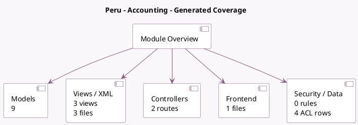

<!-- GENERATED:MODULE -->
---
tags: [odoo, community, module]
---

# Peru - Accounting

- Scope: Community Addons
- Source: odoo/addons/l10n_pe
- Dependencies: [[docs/Community Addons/base_vat/base_vat|base_vat]], [[docs/Community Addons/base_address_extended/base_address_extended|base_address_extended]], [[docs/Community Addons/l10n_latam_base/l10n_latam_base|l10n_latam_base]], [[docs/Community Addons/l10n_latam_invoice_document/l10n_latam_invoice_document|l10n_latam_invoice_document]], [[docs/Community Addons/account_debit_note/account_debit_note|account_debit_note]], [[docs/Community Addons/account/account|account]]

## Generated coverage

- Models: 9
- XML files with UI/data artifacts: 3
- Views: 3
- Actions: 0
- Menus: 0
- Rules (ir.rule): 0
- Access CSV entries: 4
- Controller units: 1
- Frontend asset files: 1

## Module map

## Detail notes

- Models: [[docs/Community Addons/l10n_pe/Models|Models]] (9)
- Views and XML: [[docs/Community Addons/l10n_pe/Views|Views]] (3 files)
- Controllers: [[docs/Community Addons/l10n_pe/Controllers|Controllers]] (1)
- Frontend: [[docs/Community Addons/l10n_pe/Frontend|Frontend]] (1 files)

## Key models

- `account.chart.template`
- `account.move`
- `account.tax`
- `l10n_latam.identification.type`
- `l10n_pe.res.city.district`
- `res.bank`
- `res.city`
- `res.company`
- `res.partner`

## Navigation

- [[../Community Addons/Community Addons|Back to scope]]
- [[../../docs/docs|Back to docs]]

<!-- GENERATED:MODULE -->

