<!-- GENERATED:MODEL -->
---
tags: [odoo, community, generated, model]
---

# l10n_pe.res.city.district

- Module: [[docs/Community Addons/l10n_pe_pos/l10n_pe_pos|l10n_pe_pos]]
- Scope: Community Addons
- Defined in module: yes
- Source files: `models/l10n_pe_res_city_district.py`
- Python classes: `L10n_PeResCityDistrict`
- Inherits: `pos.load.mixin`

## Field footprint

- Detected fields: 2
- Field types: `Many2one` x 2
- Relation fields: 2

## Sample fields

- `country_id`: `Many2one` (related `city_id.country_id`)
- `state_id`: `Many2one` (related `city_id.state_id`)

## Method hints

- Detected methods: 1
- Action methods: none
- Compute methods: none
- Onchange methods: none

## Direct relation diagram

```plantuml
@startuml
!define ODOO_COLOR_PRIMARY #714B67
!define ODOO_COLOR_ACCENT #875A7B
!define ODOO_COLOR_BG #FAF7FA

skinparam backgroundColor ODOO_COLOR_BG
skinparam defaultTextAlignment left
skinparam ArrowColor ODOO_COLOR_ACCENT
skinparam ClassBackgroundColor white
skinparam ClassBorderColor ODOO_COLOR_PRIMARY
skinparam ComponentBackgroundColor white
skinparam ComponentBorderColor ODOO_COLOR_PRIMARY
skinparam NoteBackgroundColor #FFF8FF
skinparam NoteBorderColor ODOO_COLOR_ACCENT
skinparam SequenceLifeLineBorderColor ODOO_COLOR_ACCENT
skinparam SequenceLifeLineBackgroundColor #FFFFFF
skinparam SequenceParticipantBorderColor ODOO_COLOR_PRIMARY
skinparam SequenceParticipantBackgroundColor #FFFFFF
skinparam sequence {
  ArrowColor ODOO_COLOR_ACCENT
  ActorBorderColor ODOO_COLOR_PRIMARY
}
title l10n_pe.res.city.district - Direct Relations
class "l10n_pe.res.city.district" as l10n_pe_res_city_district
@enduml
```

## Navigation

- **Parent:** [[docs/Community Addons/l10n_pe_pos/Models]]

<!-- GENERATED:MODEL -->
