<!-- GENERATED:MODEL -->
---
tags: [odoo, community, generated, model]
---

# l10n_ph_2307.wizard

- Module: [[docs/Community Addons/l10n_ph/l10n_ph|l10n_ph]]
- Scope: Community Addons
- Defined in module: yes
- Source files: `wizard/generate_2307_wizard.py`
- Python classes: `L10n_Ph_2307Wizard`
- Description: Exports 2307 data to a XLS file.

## Field footprint

- Detected fields: 2
- Field types: `Binary` x 1, `Many2many` x 1
- Relation fields: 1

## Sample fields

- `moves_to_export`: `Many2many` (comodel `account.move`)
- `xls_file`: `Binary` (comodel `Generated file`)

## Method hints

- Detected methods: 1
- Action methods: `action_generate`
- Compute methods: none
- Onchange methods: none

## Direct relation diagram

```plantuml
@startuml
!define ODOO_COLOR_PRIMARY #714B67
!define ODOO_COLOR_ACCENT #875A7B
!define ODOO_COLOR_BG #FAF7FA

skinparam backgroundColor ODOO_COLOR_BG
skinparam defaultTextAlignment left
skinparam ArrowColor ODOO_COLOR_ACCENT
skinparam ClassBackgroundColor white
skinparam ClassBorderColor ODOO_COLOR_PRIMARY
skinparam ComponentBackgroundColor white
skinparam ComponentBorderColor ODOO_COLOR_PRIMARY
skinparam NoteBackgroundColor #FFF8FF
skinparam NoteBorderColor ODOO_COLOR_ACCENT
skinparam SequenceLifeLineBorderColor ODOO_COLOR_ACCENT
skinparam SequenceLifeLineBackgroundColor #FFFFFF
skinparam SequenceParticipantBorderColor ODOO_COLOR_PRIMARY
skinparam SequenceParticipantBackgroundColor #FFFFFF
skinparam sequence {
  ArrowColor ODOO_COLOR_ACCENT
  ActorBorderColor ODOO_COLOR_PRIMARY
}
title l10n_ph_2307.wizard - Direct Relations
class "l10n_ph_2307.wizard" as l10n_ph_2307_wizard
class "account.move" as account_move
l10n_ph_2307_wizard .. account_move : moves_to_export
@enduml
```

## Navigation

- **Parent:** [[docs/Community Addons/l10n_ph/Models]]

<!-- GENERATED:MODEL -->
