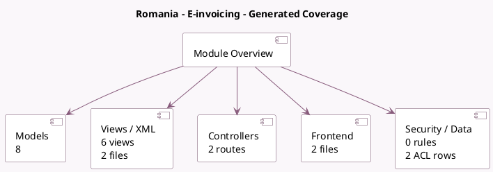

<!-- GENERATED:MODULE -->
---
tags: [odoo, community, module]
---

# Romania - E-invoicing

- Scope: Community Addons
- Source: odoo/addons/l10n_ro_edi
- Dependencies: [[docs/Community Addons/account_edi_ubl_cii/account_edi_ubl_cii|account_edi_ubl_cii]], [[docs/Community Addons/l10n_ro/l10n_ro|l10n_ro]]

## Summary

E-Invoice implementation for Romania

## Generated coverage

- Models: 8
- XML files with UI/data artifacts: 2
- Views: 6
- Actions: 1
- Menus: 0
- Rules (ir.rule): 0
- Access CSV entries: 2
- Controller units: 1
- Frontend asset files: 2

## Module map

## Detail notes

- Models: [[docs/Community Addons/l10n_ro_edi/Models|Models]] (8)
- Views and XML: [[docs/Community Addons/l10n_ro_edi/Views|Views]] (2 files)
- Controllers: [[docs/Community Addons/l10n_ro_edi/Controllers|Controllers]] (1)
- Frontend: [[docs/Community Addons/l10n_ro_edi/Frontend|Frontend]] (2 files)

## Key models

- `account.edi.xml.ubl_ro`
- `account.move`
- `account.move.send`
- `account.move.send.wizard`
- `l10n_ro_edi.document`
- `res.company`
- `res.config.settings`
- `res.partner`

## Navigation

- [[../Community Addons/Community Addons|Back to scope]]
- [[../../docs/docs|Back to docs]]

<!-- GENERATED:MODULE -->

