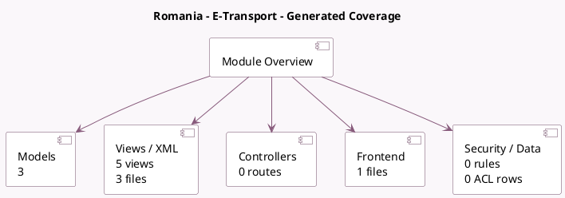

<!-- GENERATED:MODULE -->
---
tags: [odoo, community, module]
---

# Romania - E-Transport

- Scope: Community Addons
- Source: odoo/addons/l10n_ro_edi_stock
- Dependencies: [[docs/Community Addons/stock_delivery/stock_delivery|stock_delivery]], [[docs/Community Addons/l10n_ro_edi/l10n_ro_edi|l10n_ro_edi]], [[docs/Community Addons/stock_picking_batch/stock_picking_batch|stock_picking_batch]]

## Generated coverage

- Models: 3
- XML files with UI/data artifacts: 3
- Views: 5
- Actions: 0
- Menus: 0
- Rules (ir.rule): 0
- Access CSV entries: 0
- Controller units: 0
- Frontend asset files: 1

## Module map

## Detail notes

- Models: [[docs/Community Addons/l10n_ro_edi_stock/Models|Models]] (3)
- Views and XML: [[docs/Community Addons/l10n_ro_edi_stock/Views|Views]] (3 files)
- Frontend: [[docs/Community Addons/l10n_ro_edi_stock/Frontend|Frontend]] (1 files)

## Key models

- `delivery.carrier`
- `l10n_ro_edi.document`
- `stock.picking`

## Navigation

- [[../Community Addons/Community Addons|Back to scope]]
- [[../../docs/docs|Back to docs]]

<!-- GENERATED:MODULE -->

