<!-- GENERATED:MODEL -->
---
tags: [odoo, community, generated, model]
---

# stock.picking.batch

- Module: [[docs/Community Addons/l10n_ro_edi_stock_batch/l10n_ro_edi_stock_batch|l10n_ro_edi_stock_batch]]
- Scope: Community Addons
- Defined in module: extension only
- Source files: `models/stock_picking_batch.py`
- Python classes: `StockPickingBatch`

## Field footprint

- Detected fields: 23
- Field types: `Boolean` x 5, `Char` x 7, `One2many` x 1, `Selection` x 9, `Text` x 1
- Relation fields: 1

## Sample fields

- `l10n_ro_edi_stock_available_end_loc_types`: `Char` (compute `_compute_l10n_ro_edi_stock_available_location_types`)
- `l10n_ro_edi_stock_available_operation_scopes`: `Char` (compute `_compute_l10n_ro_edi_stock_available_operation_scopes`)
- `l10n_ro_edi_stock_available_start_loc_types`: `Char` (compute `_compute_l10n_ro_edi_stock_available_location_types`)
- `l10n_ro_edi_stock_document_ids`: `One2many` (comodel `l10n_ro_edi.document`)
- `l10n_ro_edi_stock_document_uit`: `Char` (compute `_compute_l10n_ro_edi_stock_current_document_uit`)
- `l10n_ro_edi_stock_enable`: `Boolean` (compute `_compute_l10n_ro_edi_stock_enable`)
- `l10n_ro_edi_stock_enable_amend`: `Boolean` (compute `_compute_l10n_ro_edi_stock_enable_amend`)
- `l10n_ro_edi_stock_enable_fetch`: `Boolean` (compute `_compute_l10n_ro_edi_stock_enable_fetch`)
- `l10n_ro_edi_stock_enable_send`: `Boolean` (compute `_compute_l10n_ro_edi_stock_enable_send`)
- `l10n_ro_edi_stock_end_bcp`: `Selection`
- `l10n_ro_edi_stock_end_customs_office`: `Selection`
- `l10n_ro_edi_stock_end_loc_type`: `Selection` (compute `_compute_l10n_ro_edi_stock_default_location_type`, store `True`)
- `l10n_ro_edi_stock_fields_readonly`: `Boolean` (compute `_compute_l10n_ro_edi_stock_fields_readonly`)
- `l10n_ro_edi_stock_operation_scope`: `Selection`
- `l10n_ro_edi_stock_operation_type`: `Selection`
- `l10n_ro_edi_stock_remarks`: `Text`
- `l10n_ro_edi_stock_start_bcp`: `Selection`
- `l10n_ro_edi_stock_start_customs_office`: `Selection`
- `l10n_ro_edi_stock_start_loc_type`: `Selection` (compute `_compute_l10n_ro_edi_stock_default_location_type`, store `True`)
- `l10n_ro_edi_stock_state`: `Selection` (compute `_compute_l10n_ro_edi_stock_current_document_state`, store `True`)

## Method hints

- Detected methods: 24
- Action methods: `action_done`, `action_l10n_ro_edi_stock_fetch_status`, `action_l10n_ro_edi_stock_send_etransport`
- Compute methods: `_compute_l10n_ro_edi_stock_available_location_types`, `_compute_l10n_ro_edi_stock_available_operation_scopes`, `_compute_l10n_ro_edi_stock_current_document_state`, `_compute_l10n_ro_edi_stock_current_document_uit`, `_compute_l10n_ro_edi_stock_default_location_type`, `_compute_l10n_ro_edi_stock_enable`, `_compute_l10n_ro_edi_stock_enable_amend`, `_compute_l10n_ro_edi_stock_enable_fetch`, and 2 more
- Onchange methods: `_l10n_ro_edi_stock_reset_variable_selection_fields`

## Direct relation diagram

```plantuml
@startuml
!define ODOO_COLOR_PRIMARY #714B67
!define ODOO_COLOR_ACCENT #875A7B
!define ODOO_COLOR_BG #FAF7FA

skinparam backgroundColor ODOO_COLOR_BG
skinparam defaultTextAlignment left
skinparam ArrowColor ODOO_COLOR_ACCENT
skinparam ClassBackgroundColor white
skinparam ClassBorderColor ODOO_COLOR_PRIMARY
skinparam ComponentBackgroundColor white
skinparam ComponentBorderColor ODOO_COLOR_PRIMARY
skinparam NoteBackgroundColor #FFF8FF
skinparam NoteBorderColor ODOO_COLOR_ACCENT
skinparam SequenceLifeLineBorderColor ODOO_COLOR_ACCENT
skinparam SequenceLifeLineBackgroundColor #FFFFFF
skinparam SequenceParticipantBorderColor ODOO_COLOR_PRIMARY
skinparam SequenceParticipantBackgroundColor #FFFFFF
skinparam sequence {
  ArrowColor ODOO_COLOR_ACCENT
  ActorBorderColor ODOO_COLOR_PRIMARY
}
title stock.picking.batch - Direct Relations
class "stock.picking.batch" as stock_picking_batch
class "l10n_ro_edi.document" as l10n_ro_edi_document
stock_picking_batch --|> l10n_ro_edi_document : l10n_ro_edi_stock_document_ids
@enduml
```

## Navigation

- **Parent:** [[docs/Community Addons/l10n_ro_edi_stock_batch/Models]]

<!-- GENERATED:MODEL -->
