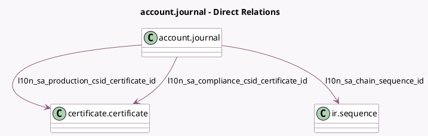

<!-- GENERATED:MODEL -->
---
tags: [odoo, community, generated, model]
---

# account.journal

- Module: [[docs/Community Addons/l10n_sa_edi/l10n_sa_edi|l10n_sa_edi]]
- Scope: Community Addons
- Defined in module: extension only
- Source files: `models/account_journal.py`
- Python classes: `AccountJournal`

## Field footprint

- Detected fields: 10
- Field types: `Binary` x 1, `Boolean` x 1, `Char` x 3, `Datetime` x 1, `Html` x 1, `Many2one` x 3
- Relation fields: 3

## Sample fields

- `l10n_sa_chain_sequence_id`: `Many2one` (comodel `ir.sequence`)
- `l10n_sa_compliance_checks_passed`: `Boolean` (comodel `Compliance Checks Done`)
- `l10n_sa_compliance_csid_certificate_id`: `Many2one` (comodel `certificate.certificate`)
- `l10n_sa_compliance_csid_json`: `Char` (comodel `CCSID JSON`)
- `l10n_sa_csr`: `Binary`
- `l10n_sa_csr_errors`: `Html` (comodel `Onboarding Errors`)
- `l10n_sa_latest_submission_hash`: `Char` (comodel `Latest Submission Hash`)
- `l10n_sa_production_csid_certificate_id`: `Many2one` (comodel `certificate.certificate`)
- `l10n_sa_production_csid_json`: `Char` (comodel `PCSID JSON`)
- `l10n_sa_production_csid_validity`: `Datetime` (related `l10n_sa_production_csid_certificate_id.date_end`)

## Method hints

- Detected methods: 29
- Action methods: none
- Compute methods: none
- Onchange methods: none

## Direct relation diagram

## Navigation

- **Parent:** [[docs/Community Addons/l10n_sa_edi/Models]]

<!-- GENERATED:MODEL -->
